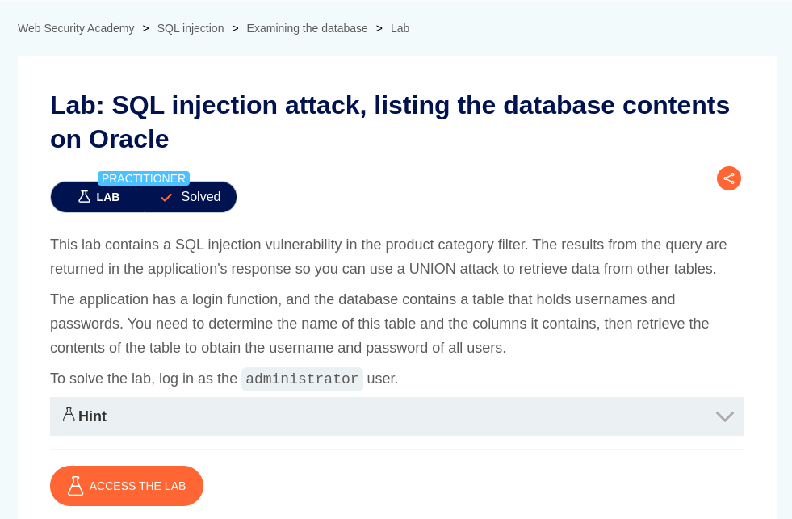
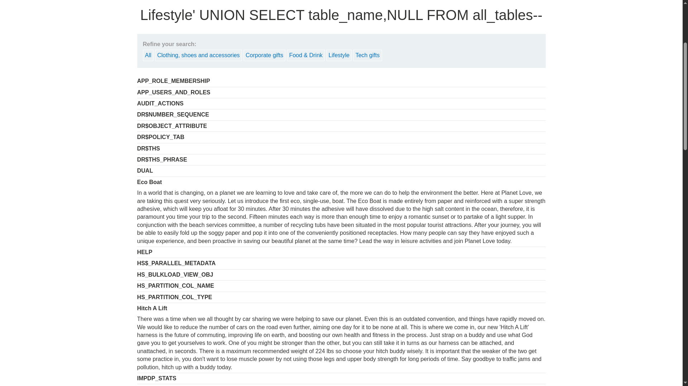
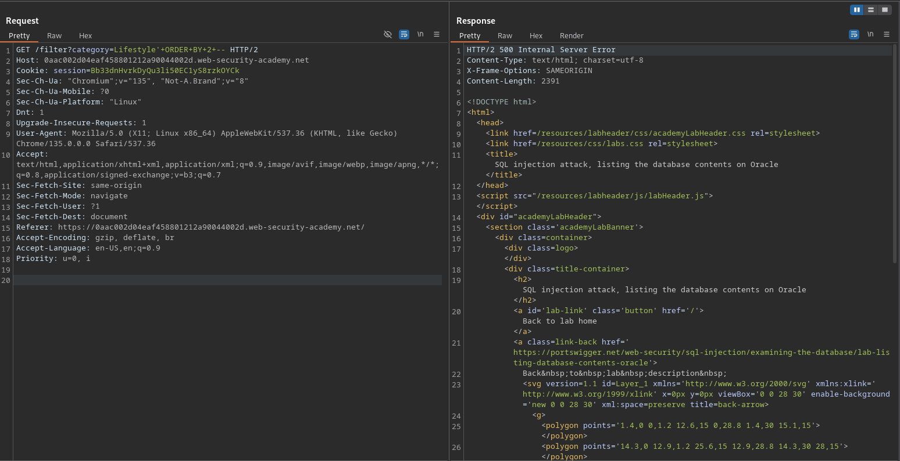

# SQL injection attack, listing the database contents on Oracle

**Lab Url**: [https://portswigger.net/web-security/sql-injection/examining-the-database/lab-listing-database-contents-oracle](https://portswigger.net/web-security/sql-injection/examining-the-database/lab-listing-database-contents-oracle)



## Analysis

The initial step is to understand how the vulnerable application works and gather information about the target system. The application showcases a product catalog with a product name and description. The navbar contains a feature to filter out products by category.

As in the previous lab, we can use the `ORDER BY` clause to determine the number of columns query returns.

```bash
'+ORDER+BY+2+--
```

## Listing Tables

We can use the payload below to list all tables in the `information_schema`.

```bash
'+union+select+null,table_name+from+all_tables+--
```



## Listing Columns

After finding a table name we can move forward and list all column names inside of that table.

```bash
'+union+select+null,column_name+from+all_tab_columns+where+table_name='USERS_XYZ'--
```



## Listing Username and Password

Now that we have determined the table and column name, we can move forward and craft a payload to extract the credentials of the `administrator` user.

```bash
'+union+select+USERNAME_XYZ,+PASSWORD_XYZ+from+USERS_XYZ--
```


After retrieving the credentials of the `administrator` user log in to solve this lab.


