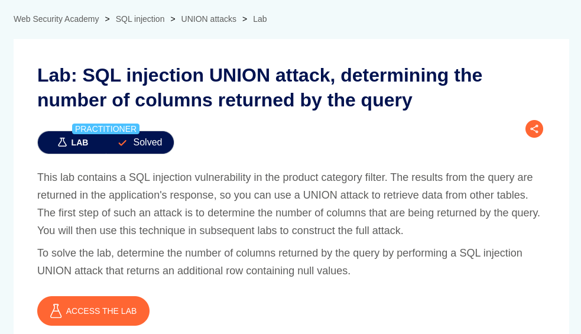

# SQL injection UNION attack, determining the number of columns returned by the query

**Lab Url**: [https://portswigger.net/web-security/sql-injection/union-attacks/lab-determine-number-of-columns](https://portswigger.net/web-security/sql-injection/union-attacks/lab-determine-number-of-columns)



## Objective

The lab objective is to determine the number of columns returned by the query.

## Solution

We can use the below payload on the category parameter to determine the number of columns returned by the query.

```bash
/filter?category=Lifestyle'+union+select+null,null,null+from+information_schema.tables+--
```

Keep incrementing the number of `NULLs` starting from 1 until you get an `internal server error`. The number of `NULL` is the number of columns returned by the query.


