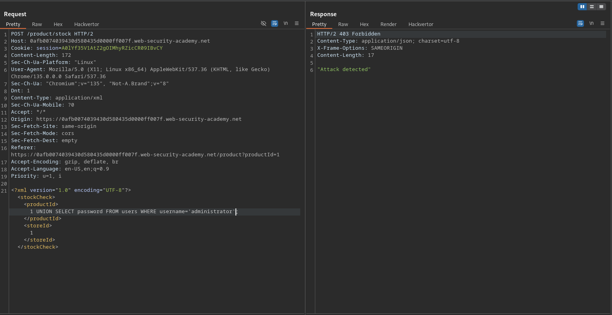
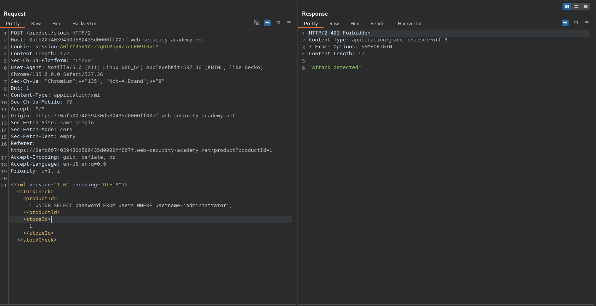
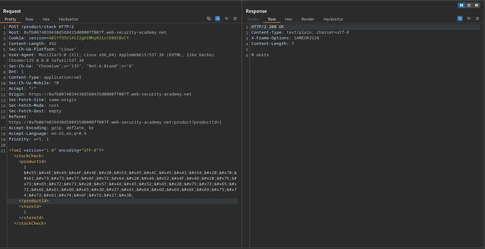
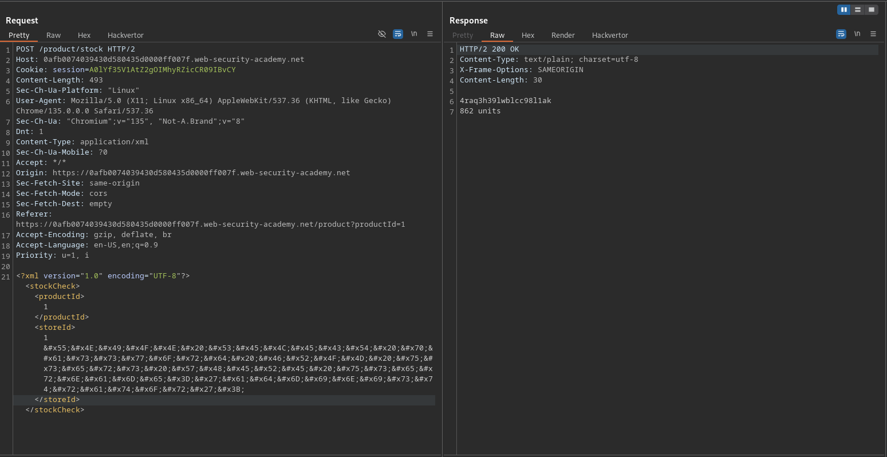
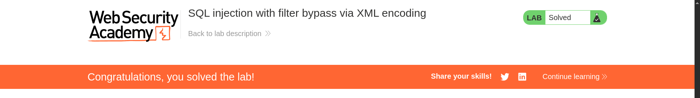

# SQL injection with filter bypass via XML encoding

**Lab Url**: [https://portswigger.net/web-security/sql-injection/lab-sql-injection-with-filter-bypass-via-xml-encoding](https://portswigger.net/web-security/sql-injection/lab-sql-injection-with-filter-bypass-via-xml-encoding)



## Analysis

The initial step is to understand how the vulnerable application works and gather information about the target system. The application showcases an image catalog with an image, a title, a price, a star rating, and a "View Details" button that redirects to the product page. The product page has a check stock functionality that transfers data in XML format.

Let's try a `UNION` attack to retrieve the administrator user's password from the user's table

```sql
UNION SELECT password FROM users WHERE username='administrator';
```



It seems that there is a web application Firewall (WAF) that blocks malicious payloads. To bypass this WAF, convert the payload into hex entities using the script below.

```python
#!/usr/bin/env python3

def to_hex_entities(text):
    return ''.join(f'&#x{ord(c):X};' for c in text)

print(to_hex_entities("UNION SELECT password FROM users WHERE username='administrator';"))
```

Now let's try to retrieve the administrator password with our crafted payload. Hmm, we got `0 units` response.



Instead of `productId` injection our payload inside `storeId`.



With the retrieved password login as an administrator user to solve the lab.


