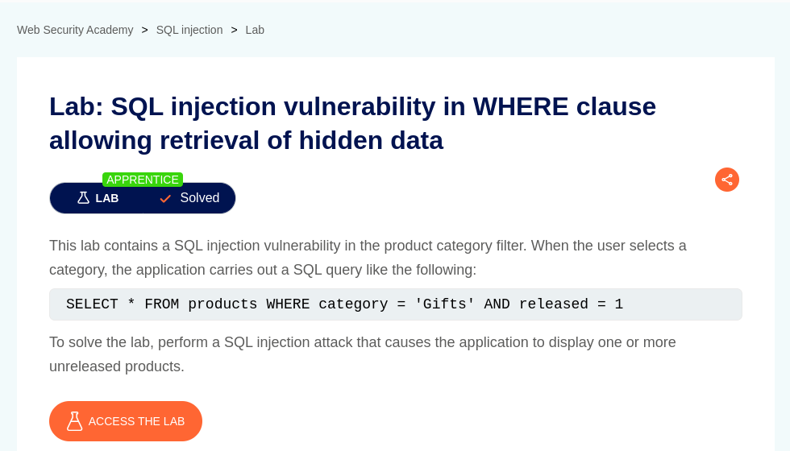
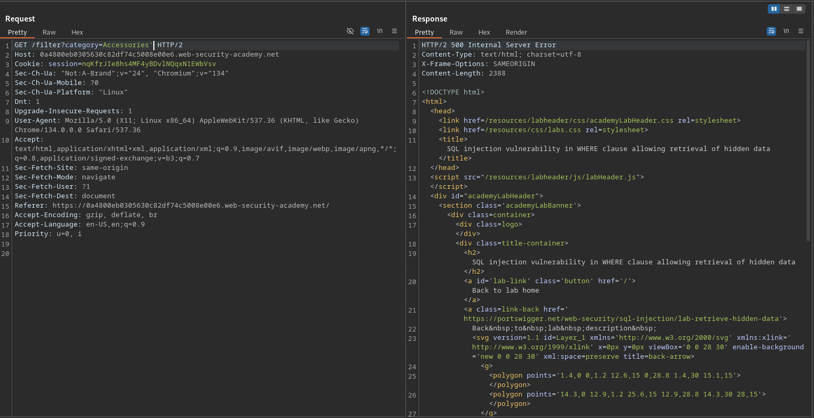
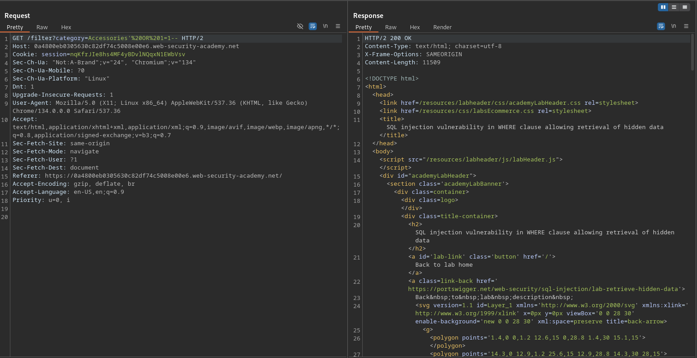
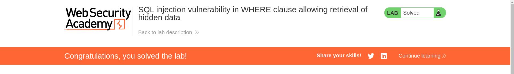

# SQL injection vulnerability in WHERE clause allowing retrieval of hidden data

**Lab Url**: [https://portswigger.net/web-security/sql-injection/lab-retrieve-hidden-data](https://portswigger.net/web-security/sql-injection/lab-retrieve-hidden-data)



## Objective

According to the lab description, this lab contains a `SQL` injection vulnerability in the product category filter. When the user selects a category, the application carries out an SQL query like the following:

```sql
SELECT * FROM products WHERE category = 'Gifts' AND released = 1
```

We have to perform an SQL injection attack that causes the application to display one or more unreleased products.

## Analysis

We know that the application filters products based on the categories. The products are filtered by a filter query parameter with an associated category.

```bash
/filter?category=Accessories
```

Let's append an apostrophe at the end of the category and observe changes. Hmm, the application threw a `500 Internal server error`.



## Conclusion

It seems our payload is causing some errors in SQL Query syntax. Now that we know that we can directly influence the `SQL` Query, we can craft a payload that will cause the application to display one or more unreleased products.

```bash
/filter?category=Accessories'%20OR%201=1--
```




