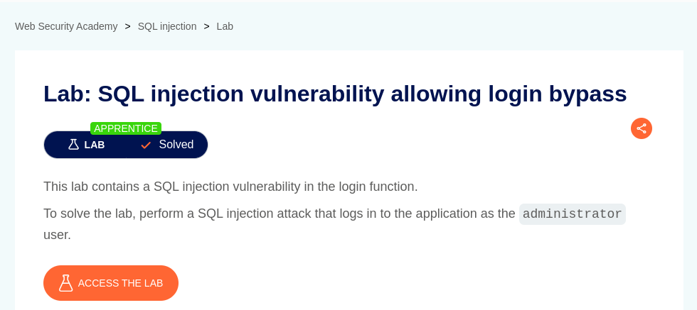
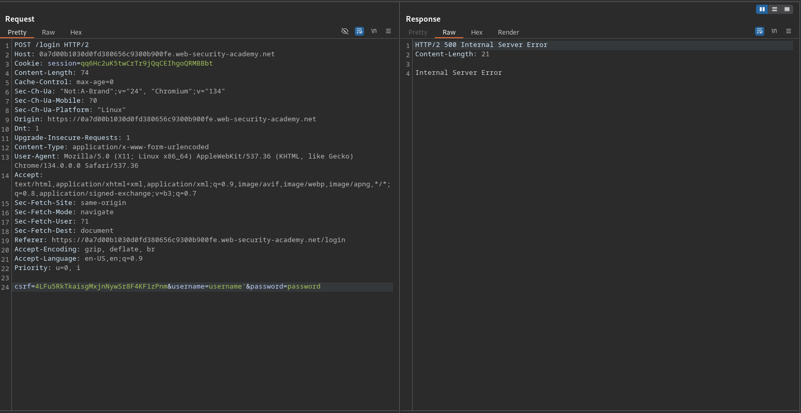
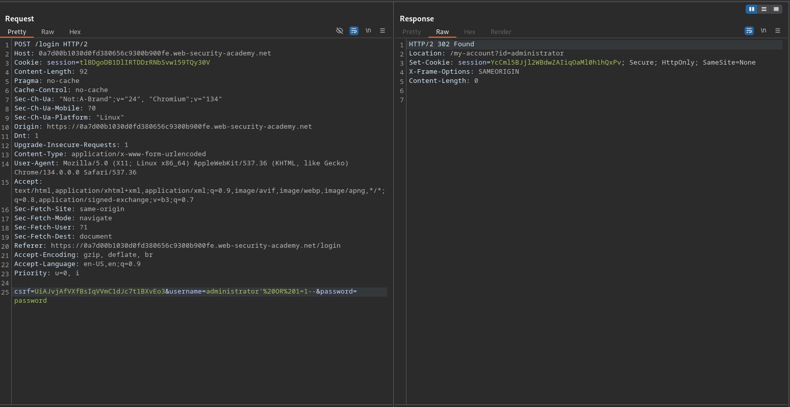
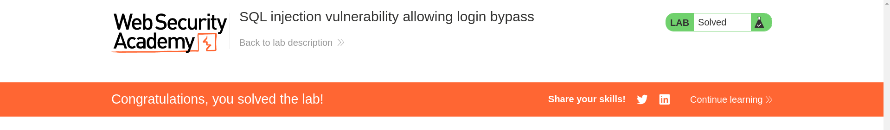

# SQL injection vulnerability allowing login bypass

**Lab Url**: [https://portswigger.net/web-security/sql-injection/lab-login-bypass](https://portswigger.net/web-security/sql-injection/lab-login-bypass)



## Objective

To perform an SQL injection attack that logs in to the application as the administrator user.

## Analysis

This application has a `/my-account` page that redirects users to the `/login` page if not logged in. The login page is vulnerable to SQL Injection. We can verify it by appending an apostrophe at the end of the username value on the Login Form submission.

```text
csrf=YOUR-TOKEN&username=username'&password=password
```



## Conclusion

Now that we know the application is vulnerable to SQL Injection attacks we can craft a payload that will allow us to bypass the login system and log us as `administrator` users.0




