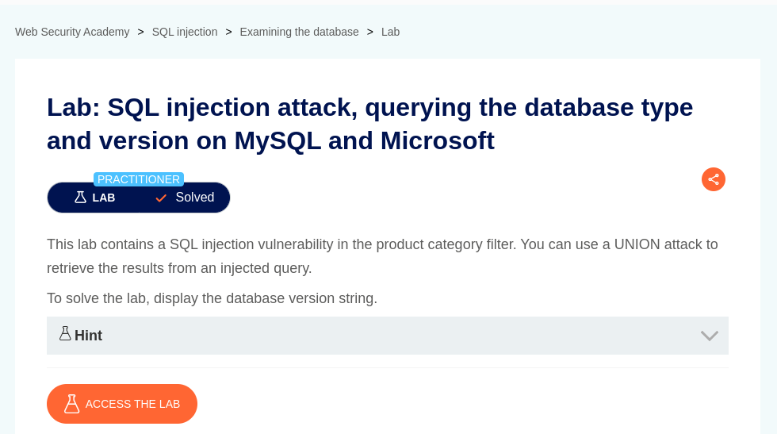
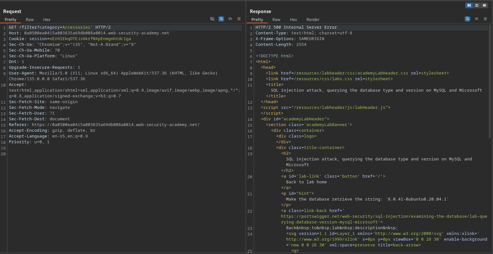
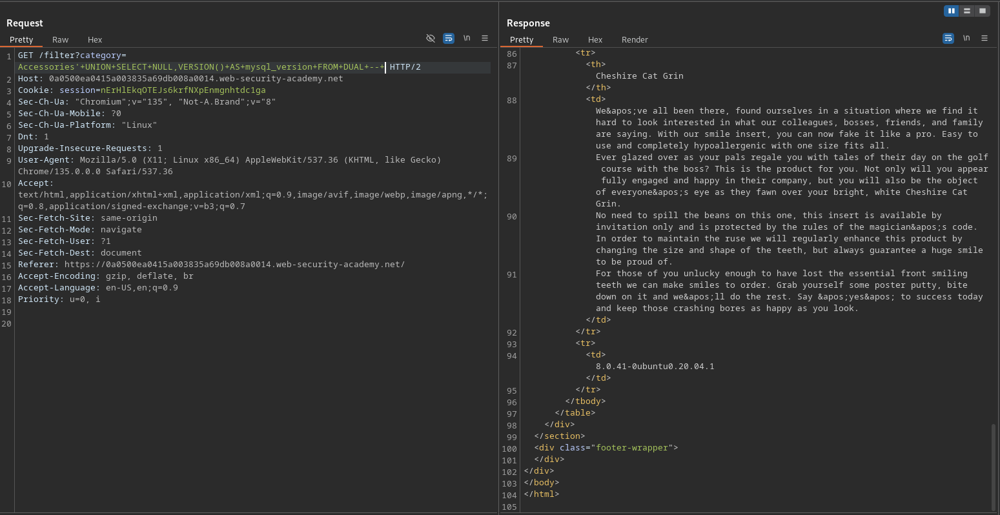

# SQL injection attack, querying the database type and version on MySQL and Microsoft

**Lab Url**: [https://portswigger.net/web-security/sql-injection/examining-the-database/lab-querying-database-version-mysql-microsoft](https://portswigger.net/web-security/sql-injection/examining-the-database/lab-querying-database-version-mysql-microsoft)



## Objective

SQL injection attack, querying the database type and version on MySQL and Microsoft

## Analysis

The initial step is to understand how the vulnerable application works and gather information about the target system. The application showcases a product catalog with a product name and description. The navbar contains a feature to filter out products by category.

Let's append an apostrophe at the end of the query to observe if the application behaves differently. Hmm, the application returned an `internal server error` with a `500 status code`.



Using `ORDER BY` clauses, it was determined that the Query returns **two** columns.

```bash
/filter?category=Accessories'+ORDER+BY+2+--+
```

## Payload

**Use the following payload to display the database version:**

```bash
'+UNION+SELECT+NULL,VERSION()+AS+mysql_version+FROM+DUAL+--+
```




