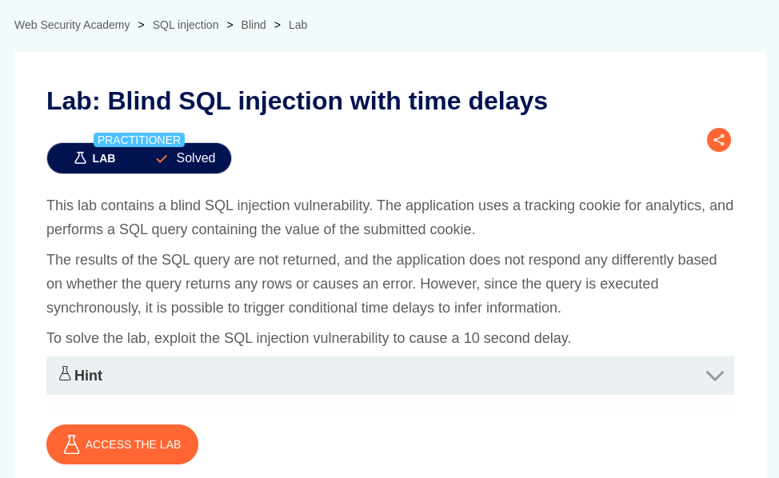

# Blind SQL injection with time delays

**Lab Url**: [https://portswigger.net/web-security/sql-injection/blind/lab-time-delays](https://portswigger.net/web-security/sql-injection/blind/lab-time-delays)



## Objective

This lab contains a blind SQL injection vulnerability. The application uses a tracking cookie for analytics, and performs a SQL query containing the value of the submitted cookie.

The results of the SQL query are not returned, and the application does not respond any differently based on error.

To solve the lab, we have to perform a blind SQL injection that will cause a 10-second delay.

## Solution

Every database has its function, to pause execution for a given number of seconds. You can find them [here](https://portswigger.net/web-security/sql-injection/cheat-sheet).

Since we don't know which database the application is running we have to try each of them one by one.

*In my case the below payload worked.*

```bash
TrackingId=YOUR-TRACKING-ID'%3B+SELECT+pg_sleep(10)+--
```


