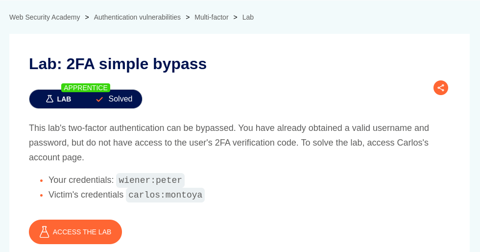

# 2FA simple bypass

**Lab Url**: [https://portswigger.net/web-security/authentication/multi-factor/lab-2fa-simple-bypass](https://portswigger.net/web-security/authentication/multi-factor/lab-2fa-simple-bypass)

## Analysis

The application has a `my-account` page that redirects to the `login` page if a user is not logged in.  If the user provides valid credentials the application requests for a `4-digit security code`.

## Solution

Even though the application asks for a `4-digit security code` for 2FA verification. The verification system is inherently flawed. The `2FA verification page` doesn't serve any purpose the user is already logged in.

To solve this lab, **log in with user Carlos's credentials provided in the lab description**. After you have provided a username and password the application will redirect you to `/login2` page. Manually change the URL from `/login2` to `/my-account` to successfully log in and access Carlos's account page.

