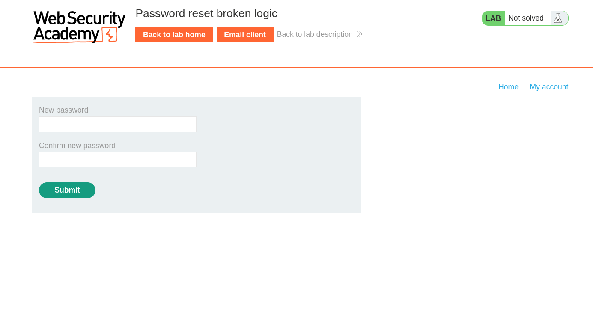

# Password reset broken logic

**Lab Url**: [https://portswigger.net/web-security/authentication/other-mechanisms/lab-password-reset-broken-logic](https://portswigger.net/web-security/authentication/other-mechanisms/lab-password-reset-broken-logic)

## Analysis

The application contains a password reset functionality on the `/forgot-password` URL. The page accepts the username or email of the user whose password you want to reset.

From the lab description, we know that there are two users `wiener` and `carlos`. Additionally, the lab provides an email client for user `wiener`.

Let's request a password reset URL for username `wiener`. Hmm, we received an email on `Wiener's` email address with a password reset token.

The password reset page has input fields to submit a new password for the user.

## Solution

To solve the lab, and log in as user `Carlos`, visit the URL sent on `Winer's` email client. First, turn on Burp intercept and then submit your desired password and remember it.

The interception tab would look something like this.

Modify the username parameter from `wiener` to `carlos` and forward the request.

Now go back to the `/login` page and log in as user `carlos` with the above-submitted password.

