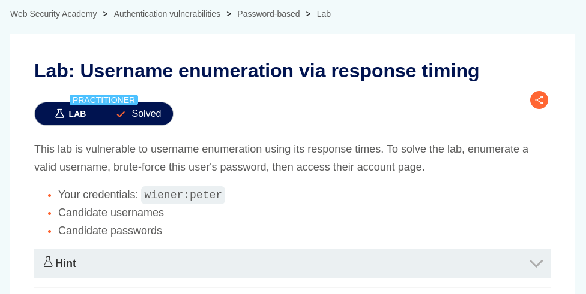
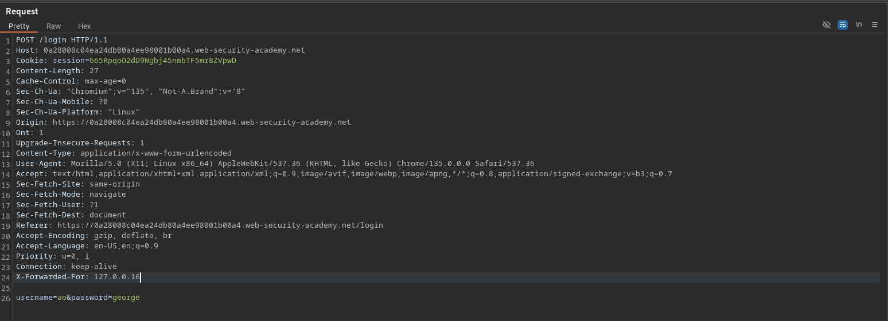
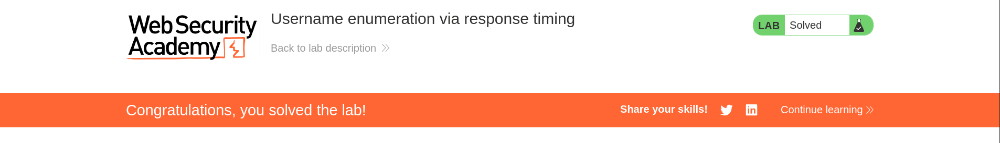

# Username enumeration via response timing

**Lab Url**: [https://portswigger.net/web-security/authentication/password-based/lab-username-enumeration-via-response-timing](https://portswigger.net/web-security/authentication/password-based/lab-username-enumeration-via-response-timing)

## Analysis

The lab contains a login page with a `username` and `password` field. Like the previous labs, this one is also vulnerable to **username enumeration**.

Applications usually check whether the `password` is correct only if the `username` is valid. *If a large password is injected on the password field and if the username is valid then it might cause a delay in response time.*

We can use a large password payload to enumerate a valid username. But there is another problem the lab has a **`WAF**` that implements a form of `IP-based brute-force` protection. To bypass this we can add a random value to the `X-Forwarded-For` header.

## Solution

Use the script `enumerate_username.py` and extract the `username` of the request which took the longest time to complete. After extracting the `username`, use it on script `enumerate_password.py` to extract the user's password.

Now turn on Burp intercept and submit the login form with the extracted `username` and `password`. On the interception tab add or modify `X-Forwarded-For` header to an unknown value and submit the request to solve the lab.

