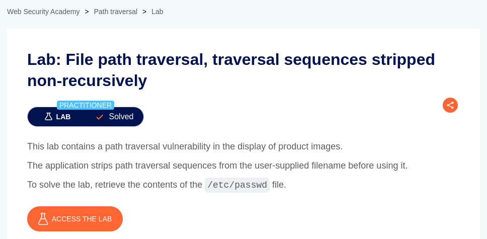
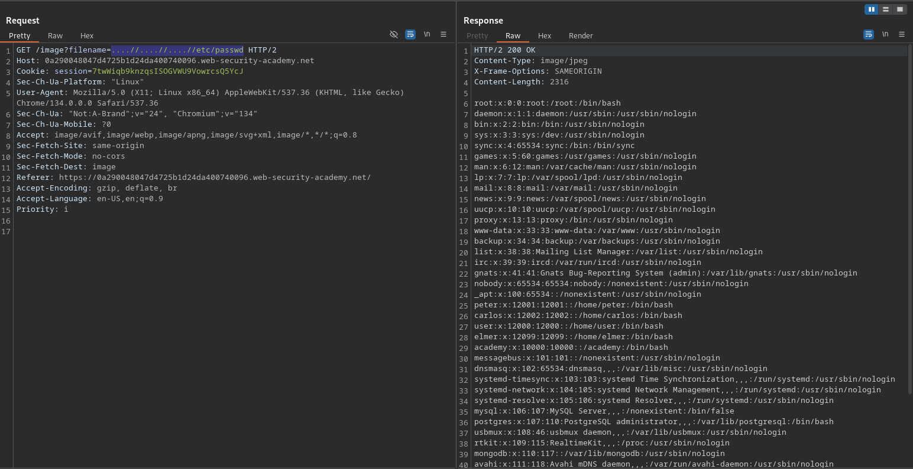

# File path traversal, traversal sequences stripped non-recursively

**Lab Url**: [https://portswigger.net/web-security/file-path-traversal/lab-sequences-stripped-non-recursively](https://portswigger.net/web-security/file-path-traversal/lab-sequences-stripped-non-recursively)



## Goal

According to the lab description, this lab contains a path traversal vulnerability. However, the application does some validation like striping the path traversal sequences from the user-supplied filename before using it. To solve this lab, retrieve the contents of the `/etc/passwd` file bypassing this validation.

## Conclusion

Using simple path traversal sequences like `../etc/passwd` doesn't return the content of the file, this is because the application performs some validation stripping path traversal sequences as mentioned in the lab description. Thus the user-supplied value `../etc/passwd` becomes `etc/passwd`.

## Solution

To solve this lab, we have to meticulously craft a payload that bypasses this validation. We know, that the application strips `../`. Thus, we can provide a payload that represents a path traversal string after the removal of the initial payload.

```bash
/image?filename=....//....//....//etc/passwd
```




