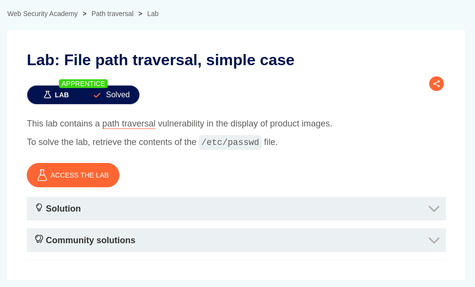
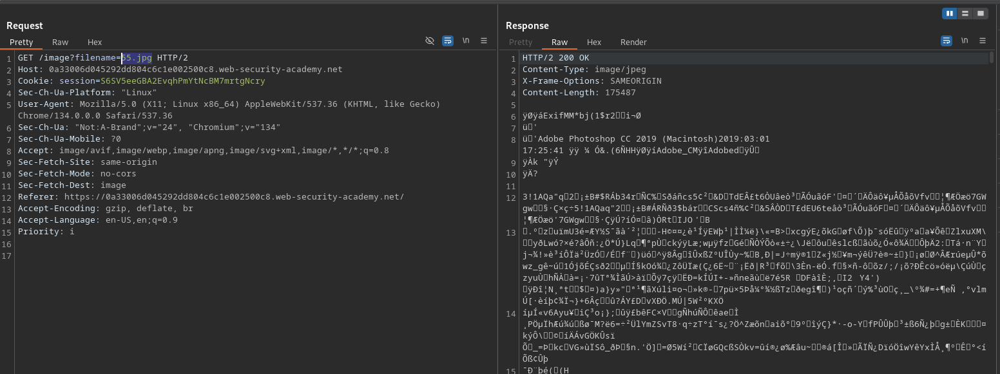
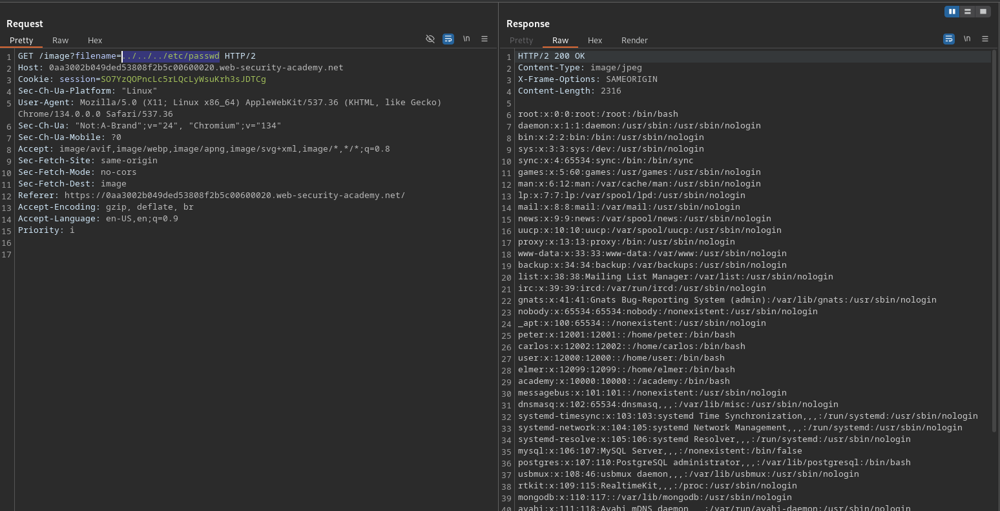

# File path traversal, simple case

**Lab Url**: [https://portswigger.net/web-security/file-path-traversal/lab-simple](https://portswigger.net/web-security/file-path-traversal/lab-simple)



## Goal

According to the lab description, this lab contains a path traversal vulnerability. To solve this lab, we have to retrieve the contents of the `/etc/passwd` file. *The `/etc/passwd` file is a plain text file that stores basic information about user accounts on a Linux system, including usernames, user IDs (UIDs), group IDs (GIDs), home directories, and default shells, but not the actual passwords.*

## Reconnaissance

The initial step is to understand how the vulnerable application works and gather information about the target system.


The image catalog showcases a collection of novelty and quirky products, including fun gadgets, humorous accessories, and unique gift items. Each product is visually displayed with an image, a title, a price, a star rating, and a "View details" button, resembling a typical eCommerce store layout. After a look at the network tab, it is concluded that the application loads product images as filenames like `/images?filename=01.jpg` hinting at a possible path traversal vulnerability.



## Solution

In the requester tab, I tried to retrieve the content of `etc/passwd` using absolute path `/etc/passwd` but got a **400 Bad request** error. After adding three successive `../` I was able to receive the content of `/etc/passwd`. *It is a relative path traversal technique used to move upward in the directory structure by navigating to parent directories.*

```bash
/image?filename=../../../etc/passwd
```




