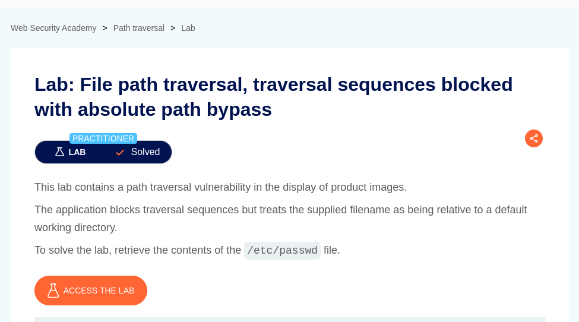
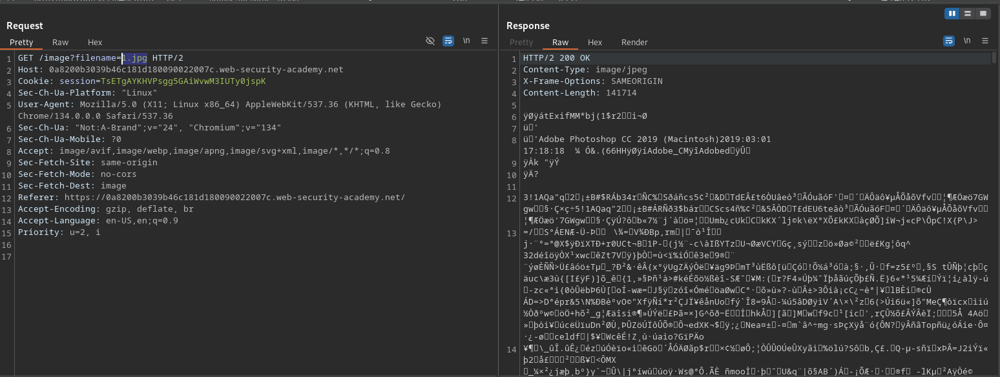
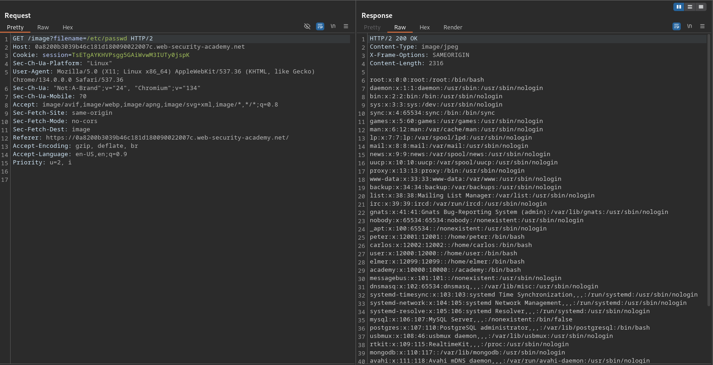

# File path traversal, traversal sequences blocked with absolute path bypass

**Lab Url**: [https://portswigger.net/web-security/file-path-traversal/lab-absolute-path-bypass](https://portswigger.net/web-security/file-path-traversal/lab-absolute-path-bypass)



## Goal

According to the lab description, this lab contains a path traversal vulnerability which can be bypassed using absolute path. To solve this lab, we have to retrieve the contents of the `/etc/passwd` file. *The `/etc/passwd` file is a plain text file that stores basic information about user accounts on a Linux system, including usernames, user IDs (UIDs), group IDs (GIDs), home directories, and default shells, but not the actual passwords.*

## Reconnaissance

The initial step is to understand how the vulnerable application works and gather information about the target system.


The image catalog showcases a collection of products. Each product is displayed with an image, a title, a price, a star rating, and a "View details" button. After a look at the network tab, it is concluded that the application loads product images using filename query `/images?filename=01.jpg`.



## Solution

In the requester tab, try to retrieve the content of `passwd` file using absolute path `/etc/passwd`.

```bash
/images?filename=/etc/passwd
```




