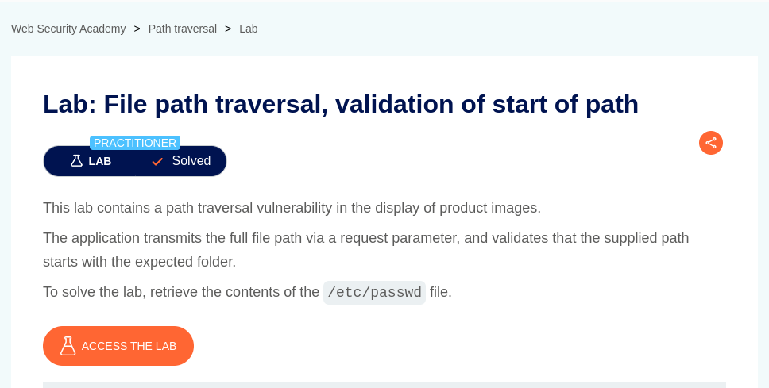
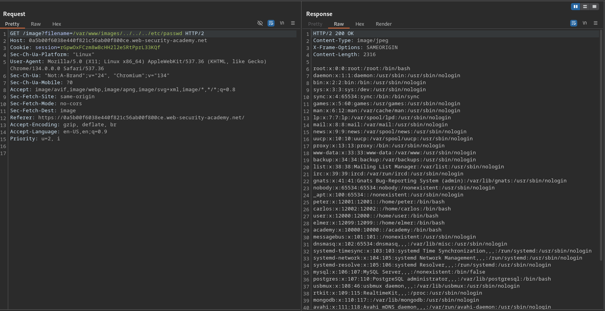
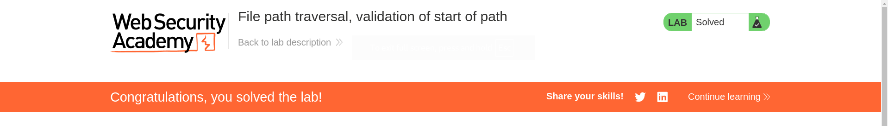

# File path traversal, validation of start of path

**Lab Url**: [https://portswigger.net/web-security/file-path-traversal/lab-validate-start-of-path](https://portswigger.net/web-security/file-path-traversal/lab-validate-start-of-path)



## Goal

This application transmits the full file path via a request parameter and validates that the supplied path starts with the expected folder. The goal is to retrieve the contents of `/etc/passwd`.

## Analysis

The application checks that the path starts with the expected values, in this case, the absolute path `/var/www/images`, so neither different absolute paths (`/etc/passwd`) nor relative paths (`../../../etc/passwd`) are possible.

## Solution

The application blocks both absolute and relative paths for accessing files outside of the intended directory. We can bypass this by adding **dot-dot-slash** (`../`) sequences after the intended path, which in this case is `/var/www/images`. This will navigate up the directory structure to access restricted files by attempting to traverse out of the web application's root directory and access the system files.

## Payload

```bash
/image?filename=/var/www/images/../../../etc/passwd
```




