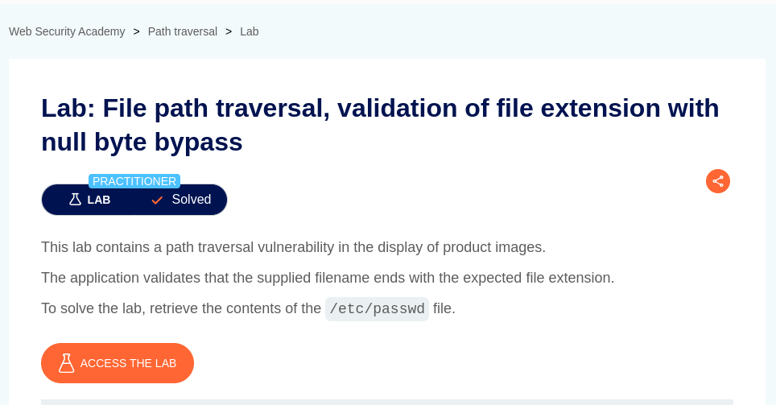

# File path traversal, validation of file extension with null byte bypass

**Lab Url**: [https://portswigger.net/web-security/file-path-traversal/lab-validate-file-extension-null-byte-bypass](https://portswigger.net/web-security/file-path-traversal/lab-validate-file-extension-null-byte-bypass)



## Goal

This lab demonstrates a path traversal vulnerability. The application validates that the supplied filename ends with the expected file extension like (`.png` or `.jpg`). The goal is to retrieve the contents of `/etc/passwd`.

## Background

The null character (also null terminator) is a control character with the value zero. It is a special character used to indicate the end of a string in languages like C and C++. It helps define string boundaries in memory but can also appear in binary data, file formats, and network protocols. In security, null byte injection was a common exploit where attackers inserted `%00` to manipulate file handling or bypass validation in poorly coded applications.

You can find more information about Null Byte [here](https://en.wikipedia.org/wiki/Null_character).

## Conclusion

The application doesn't return any meaningful response on both absolute and relative path payloads. From the lab description, it is concluded that the application only returns a response if the file extension is a valid image type. However, we know that a `/etc/passwd` file is a plain text file. Thus, we can use **Null Byte** to truncate the file path by prematurely ending the string, and bypassing security filters or file extension checks.

## Payload

```bash
/image?filename=../../../etc/passwd%00.jpg
```


