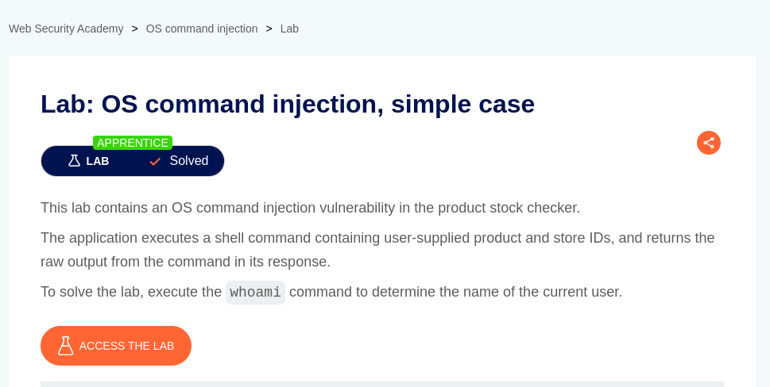
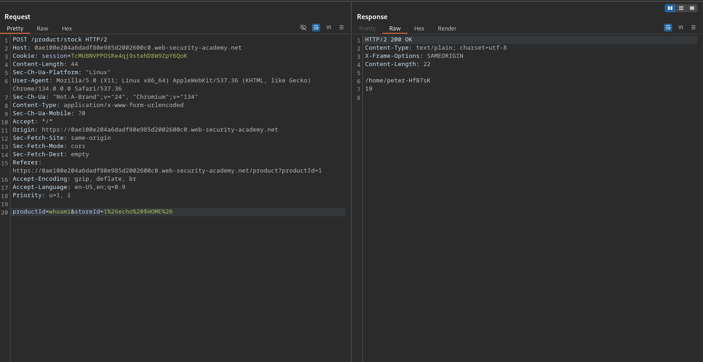
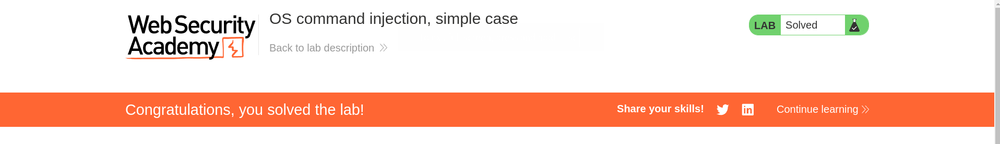

# OS command injection, simple case

**Lab Url**: [https://portswigger.net/web-security/os-command-injection/lab-simple](https://portswigger.net/web-security/os-command-injection/lab-simple)



## Analysis

The initial step is to understand how the vulnerable application works and gather information about the target system. The application showcases an image catalog with an image, a title, a price, a star rating, and a "View details" button. The view details button redirects to the product information page. The product page contains a Check stock functionality.

The check stock button issues a post request on submission with two parameters: `productId` and `storeId`. The response is of `Content-Type: text/plain;`

## Solution

Let's try to perform a command injection by sabotaging the `storeId` parameter to execute a shell command.

To execute the `whoami` command URL encode the payload:

```bash
echo whoami & --> echo%20whoami%20%26
```


We can also retrieve the path of users' home directory by printing `$HOME`




