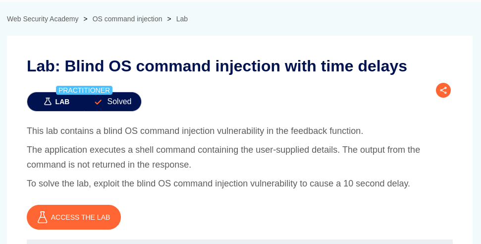
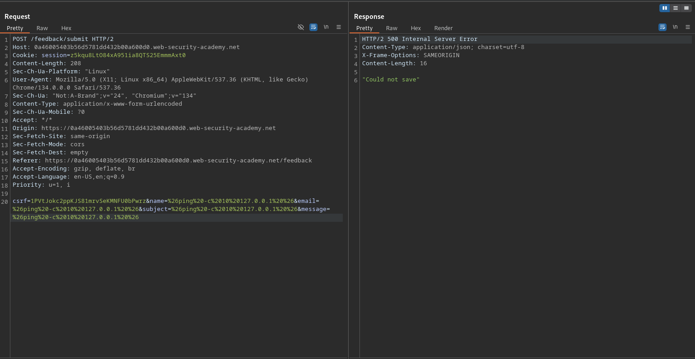

# Blind OS command injection with time delays

**Lab Url**: [https://portswigger.net/web-security/os-command-injection/lab-blind-time-delays](https://portswigger.net/web-security/os-command-injection/lab-blind-time-delays)



## Analysis

The initial step is to understand how the vulnerable application works and gather information about the target system. Like previous applications, this one also showcases an image catalog with an image, a title, a price, a star rating, and a "View details" button. But it also has an additional submit feedback page (`/feedback`).

The feedback page consists of a form with the submit (`/feedback/submit`) action and `POST` method. The post method consists of the following payload: `csrf`, `name`, `email`, `subject`, and `message`. According to the lab description, the goal of the lab is to execute an **OS command injection to cause a 10-second delay**.

## Solution

The `ping` command is a good way to do this, because it lets you specify the number of ICMP packets to send. This enables you to control the time taken for the command to run:

```bash
& ping -c 10 127.0.0.1 &
```

The injected command will trigger a time delay, enabling you to confirm that the command was executed based on the time that the application takes to respond.




