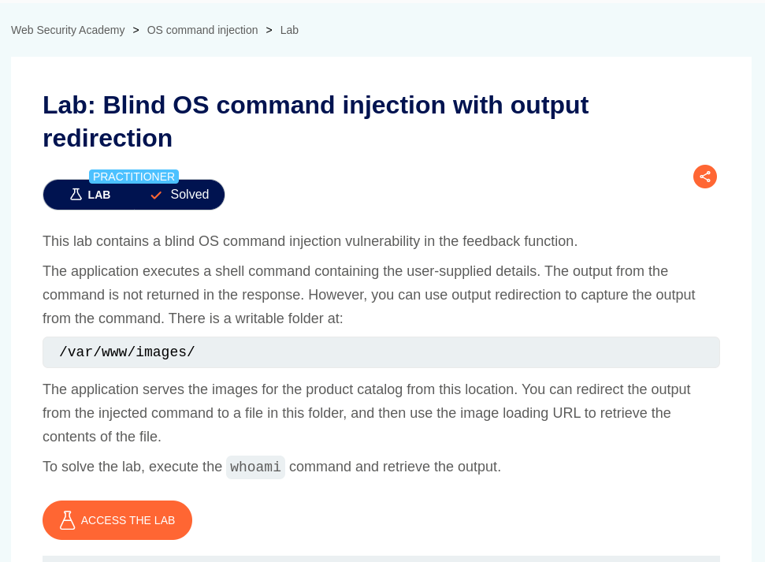
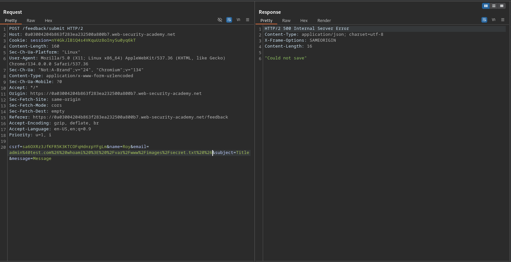
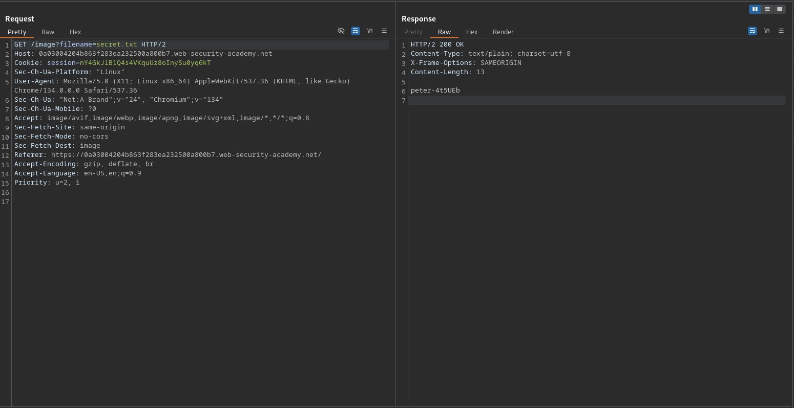

# Blind OS command injection with output redirection

**Lab Url**: [https://portswigger.net/web-security/os-command-injection/lab-blind-output-redirection](https://portswigger.net/web-security/os-command-injection/lab-blind-output-redirection)



## Analysis

Like previous applications, this one also showcases an image catalog with an image, a title, a price, a star rating, a "View details" button, and a submit feedback page (`/feedback`). However, according to the lab description, the output from the command is not returned in the response. So we have to use output redirection to capture the output from the command.

The writable folder is provided in lab description:

```bash
/var/www/images/
```

## Solution

We can redirect the output from the injected command into a file within the web root using the following command:

```bash
& whoami > /var/www/images/secret.txt &
```



Now we can retrieve the stored secret content from the application's static resource endpoint.




