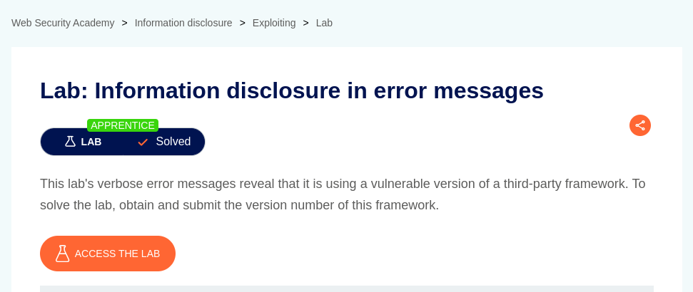
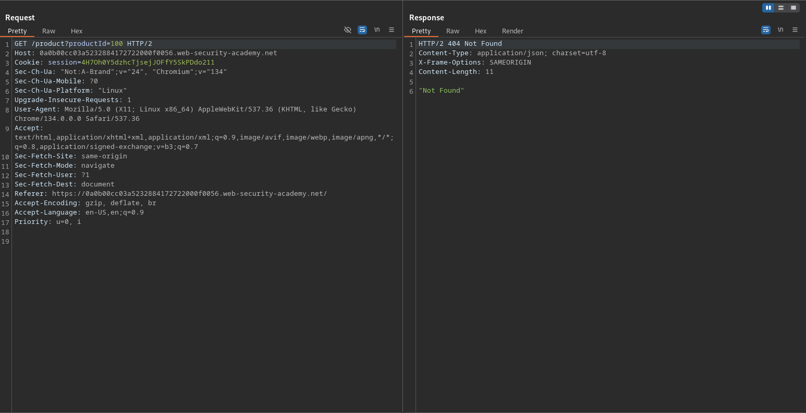
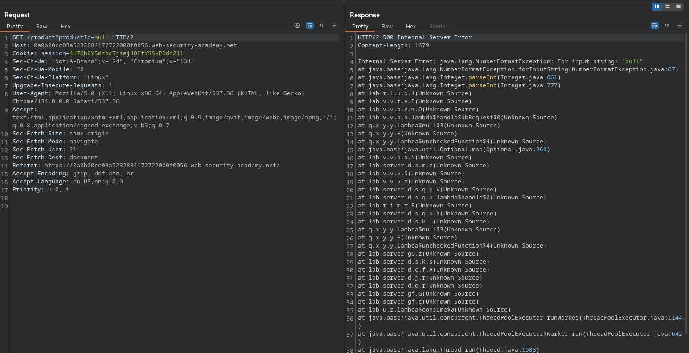

# Information disclosure in error messages

**Lab Url**: [https://portswigger.net/web-security/information-disclosure/exploiting/lab-infoleak-in-error-messages](https://portswigger.net/web-security/information-disclosure/exploiting/lab-infoleak-in-error-messages)

## Analysis

The initial step is to understand how the vulnerable application works and gather information about the target system. The application showcases an image catalog with an image, a title, a price, a star rating, and a "View details" button. The "view details" button redirects to the product page. The product page has a `productId` parameter with an `integer` as its value.

## Modifying parameter

Let's try experimenting with some unexpected value as the productId parameter.

First, let's try to fetch non-existing product. The application returns a **`404` error**.

Now, let's try to fetch product with unexpected values like **non-numeric** values as parameter.

**Payload: `/product?productId=null`**

The application does not handle this error gracefully and reveals sensitive information client side when it encounters an unexpected value. In this case, we were able to figure out the version of a third-party framework which is 2.0 `Apache Struts 2 2.3.31`.

