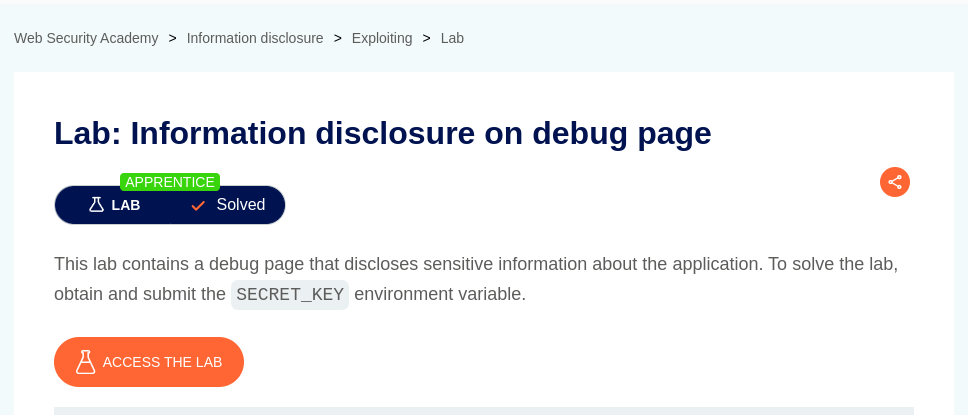
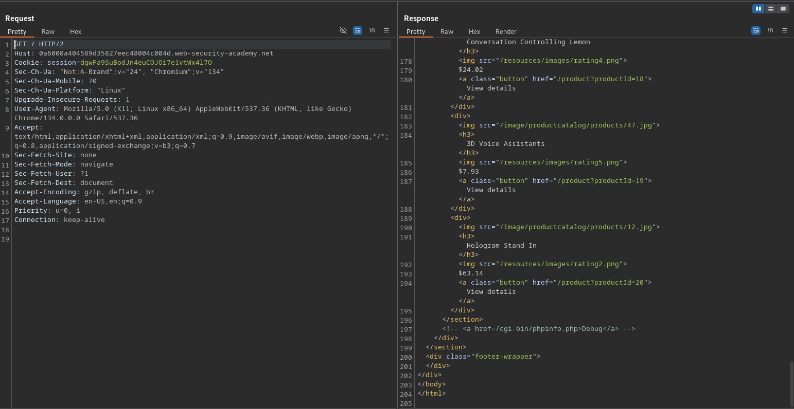
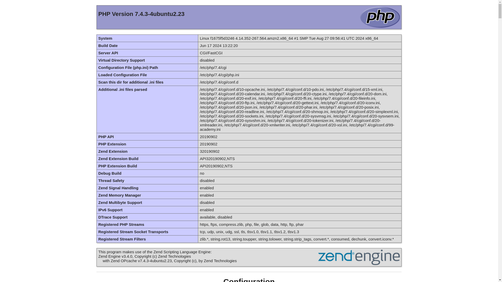
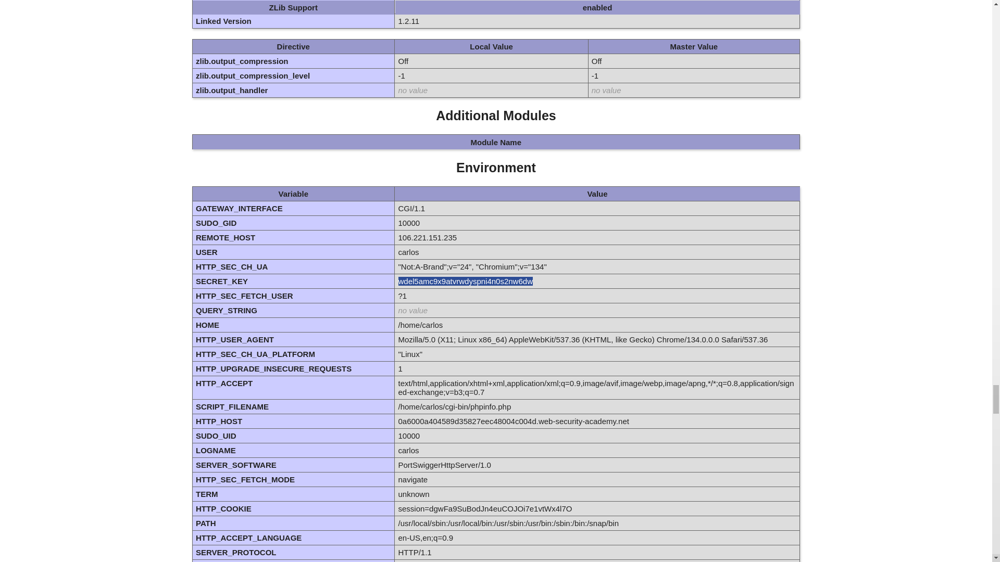
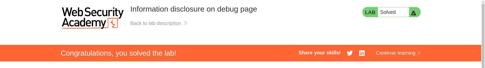

# Information disclosure on debug page

**Lab Url**: [https://portswigger.net/web-security/information-disclosure/exploiting/lab-infoleak-on-debug-page](https://portswigger.net/web-security/information-disclosure/exploiting/lab-infoleak-on-debug-page)

## Analysis

The initial step is to understand how the vulnerable application works and gather information about the target system. Upon examining the source code of the home or index page. I stumbled upon a comment that disclosed the path to the **debug** page in this case `phpinfo` page.

You can find more information about `phpinfo` page [here](https://www.php.net/manual/en/function.phpinfo.php).

According to the lab description you need to submit a `SECRET_KEY` to solve this lab.

Submit the `SECRET_KEY` to solve this lab.

