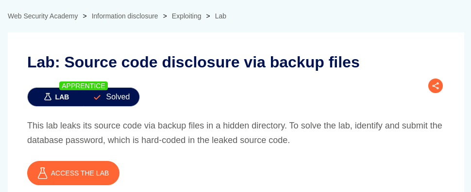
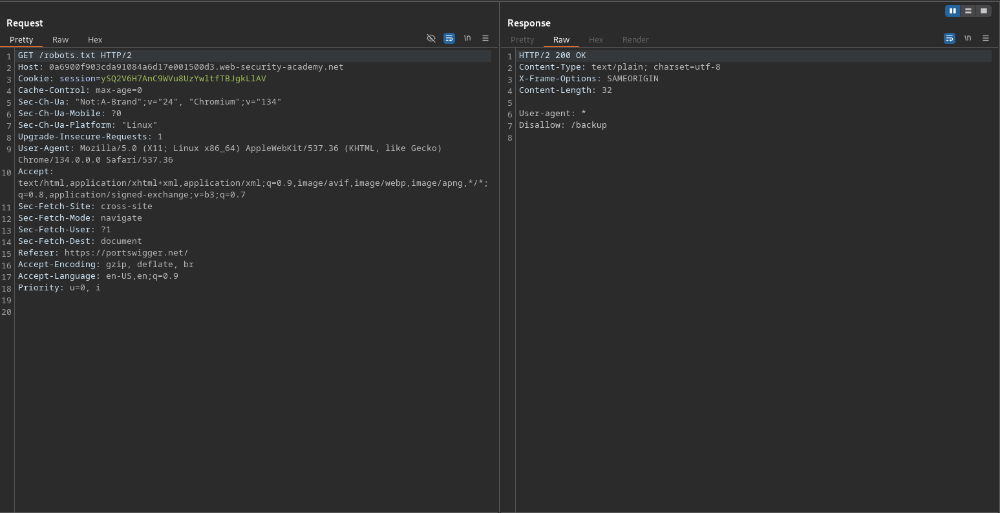
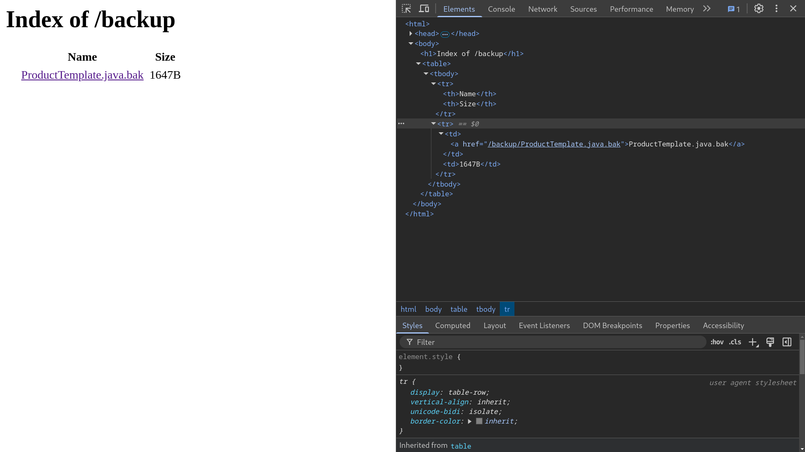
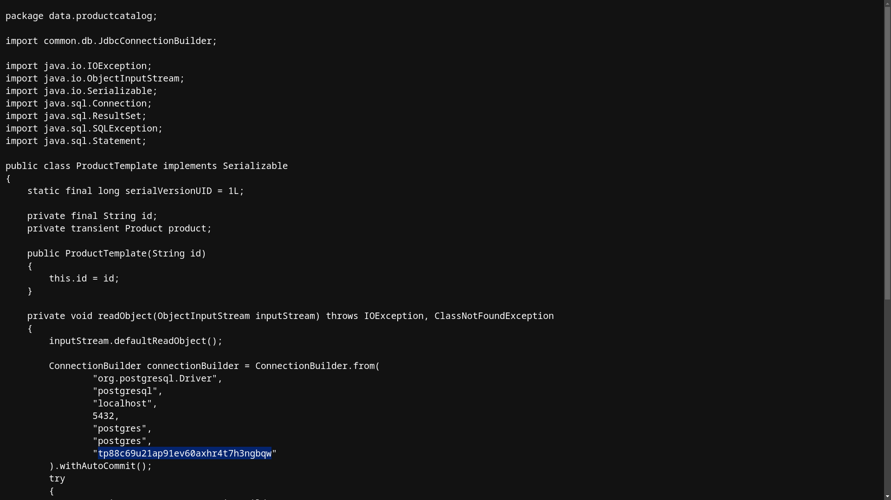

# Source code disclosure via backup files

**Lab Url**: [https://portswigger.net/web-security/information-disclosure/exploiting/lab-infoleak-via-backup-files](https://portswigger.net/web-security/information-disclosure/exploiting/lab-infoleak-via-backup-files)

## Analysis

The initial step is to understand how the vulnerable application works and gather information about the target system. The application contains a **`robots.txt`** file that discloses a hint of the existence of a backup directory.

After visiting the backup page, I found a link that redirects to `ProductTemplate.java.bak` which typically represents a backup copy of a Java source code file.

You can find the **password** of the `Postgres` database hardcoded in the source code file.

Submit the **password** to solve this lab.

