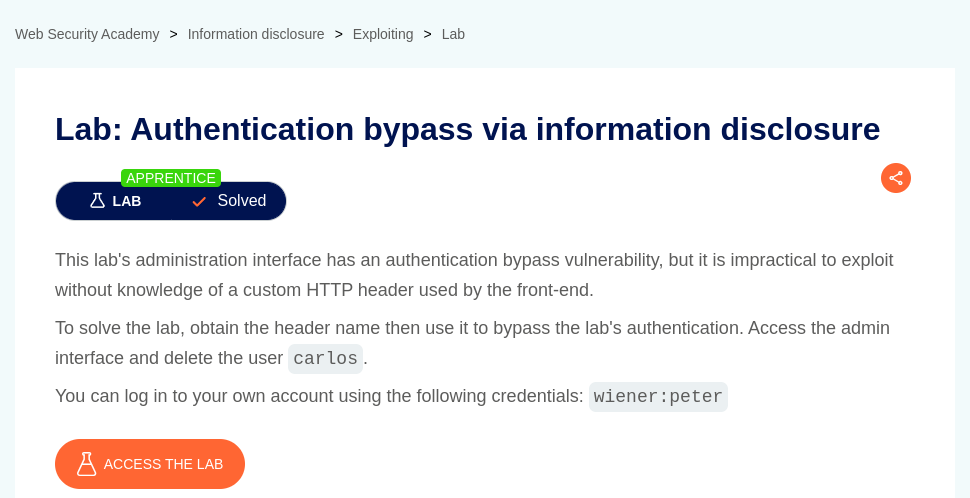
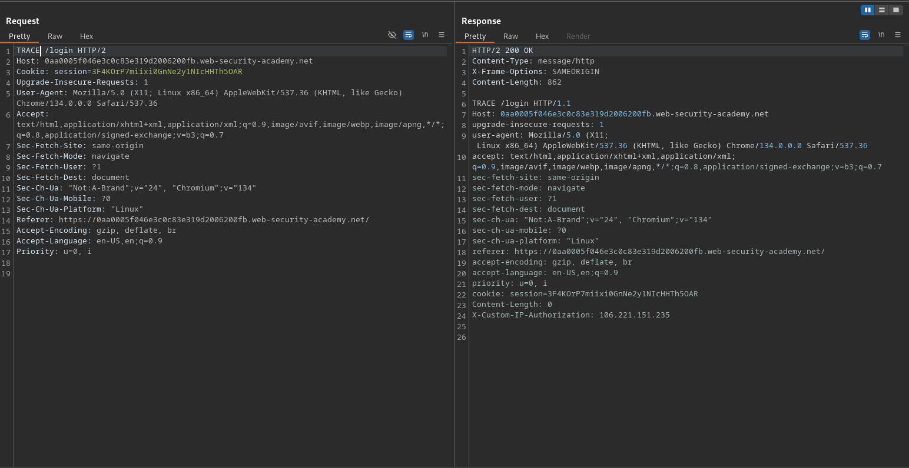
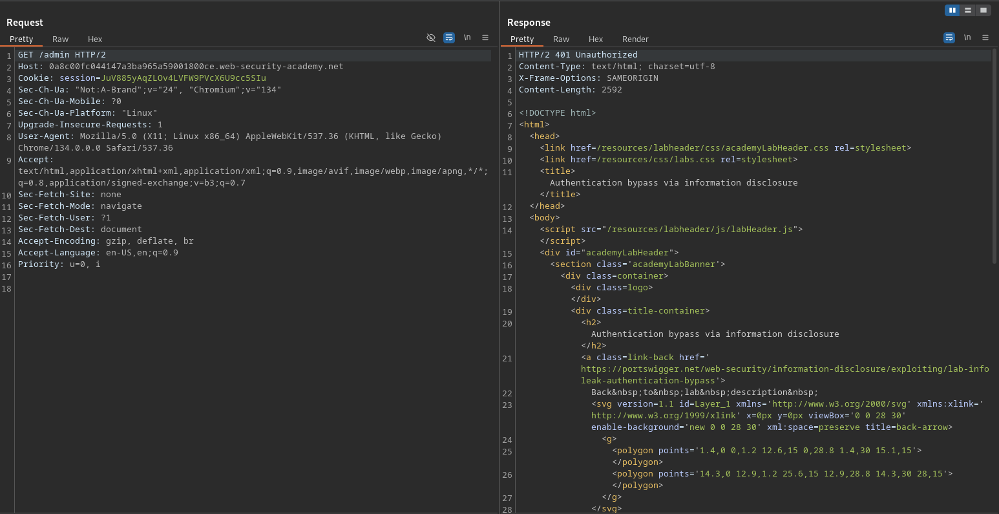
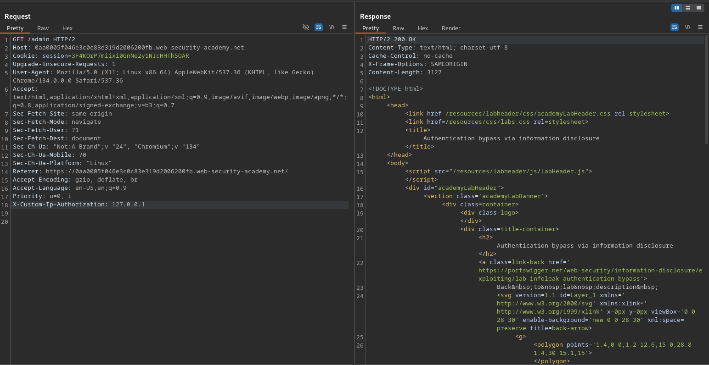
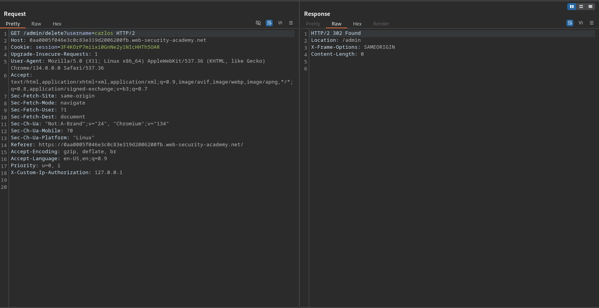
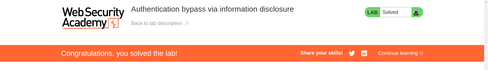

# Authentication bypass via information disclosure

**Lab Url**: [https://portswigger.net/web-security/information-disclosure/exploiting/lab-infoleak-authentication-bypass](https://portswigger.net/web-security/information-disclosure/exploiting/lab-infoleak-authentication-bypass)

## Analysis

As usual, the initial step is to understand how the vulnerable application works and gather information about the target system. The application has a `/my-account` page that redirects to the `/login` page if a user is not logged in.

The login page supports both the `GET` and `POST` method we know that because the login page has a form with the `POST` method in it. Examining whether it supports other `HTTP` methods. After a little bit of testing, I found that the login page also supports the `TRACE` HTTP method. The `TRACE` HTTP method performs a message loop-back test along the path to the target resource.

You can find more information about `TRACE HTTP` method [here](https://developer.mozilla.org/en-US/docs/Web/HTTP/Reference/Methods/TRACE).

The TRACE method returns an interesting header `X-Custom-IP-Authorization`. The `X-Custom-IP-Authorization` header is a non-standard HTTP header that some web applications or APIs use for IP-based authorization. It typically allows access to certain resources based on the provided IP address in the header.

Let's move to a different aspect of the web application. In the lab description, it is provided that this application contains an **admin interface**. After a little bit of fuzzing, I landed at the admin page that returns the `401 Status Code` which means you are unauthorized to access this page.

Let's add the `X-Custom-IP-Authorization` header that we found from the TRACE method. And set the Ip to `127.0.0.1`.

Now we are successfully, able to get the admin page. After examining the admin page, I found the appropriate path to delete the username `carlos`.

