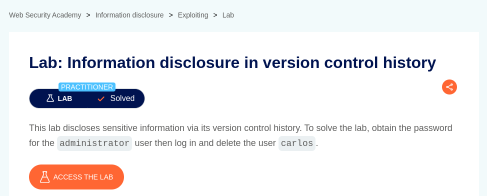
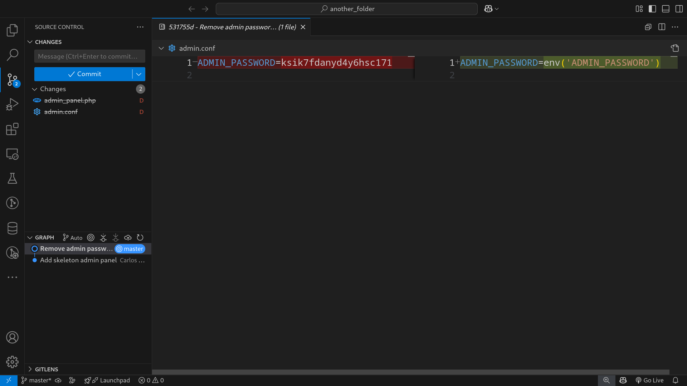
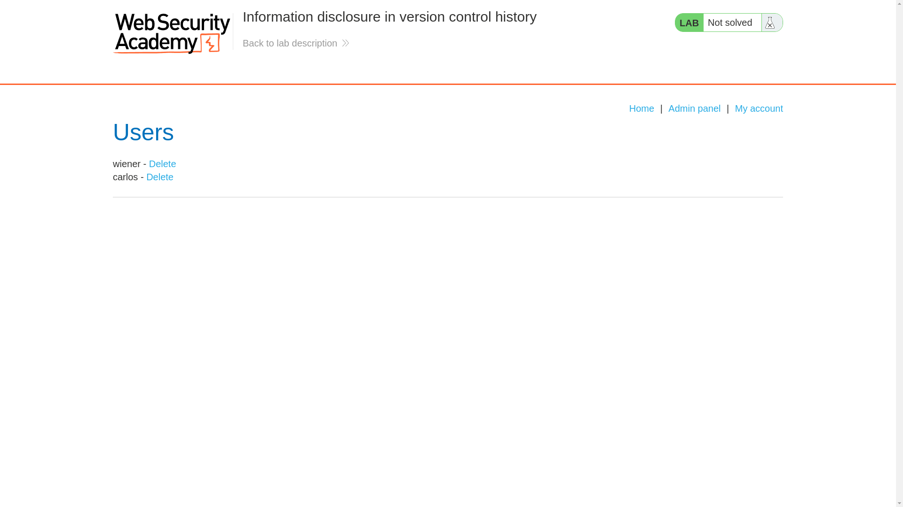
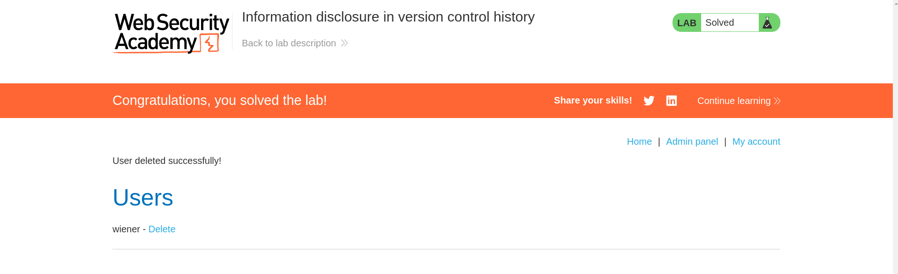

# Information disclosure in version control history

**Lab Url**: [https://portswigger.net/web-security/information-disclosure/exploiting/lab-infoleak-in-version-control-history](https://portswigger.net/web-security/information-disclosure/exploiting/lab-infoleak-in-version-control-history)



## Solution

The solution for this lab is straightforward. As mentioned in the lab description, the lab discloses sensitive information via its version control history.

This application uses git as its version control, which we can confirm by visiting the `.git` path of the application. We can download the entire content of the `/.git` recursively.

```bash
wget -r -np -nH --cut-dirs=1 https://YOUR-LAB-ID.web-security-academy.net/.git
```

I am using `vscode` Source control to examine and compare the diff and to find sensitive information.You can also issue the `git log --oneline` command to view all commits.

```bash
306436a (HEAD -> master) Remove admin password from config
92683c8 Add skeleton admin panel
```

Create a `folder2` inside `folder1` and download the contents from the website inside `folder2`. Rename the `folder2` to `.git`. Now use `vscode` Source control or any other extension of your liking to find the admin password.



Now login as `administrator` and delete the user `carlos`.




