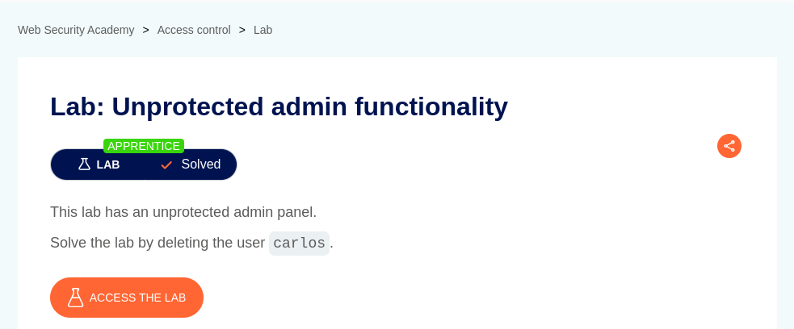
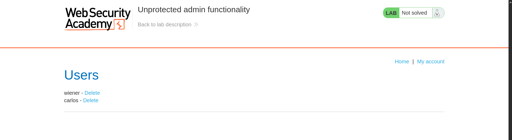
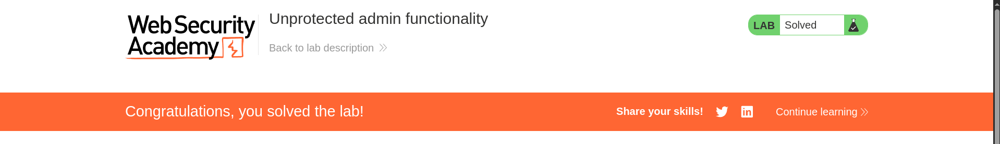

# Unprotected admin functionality

**Lab Url**: [https://portswigger.net/web-security/access-control/lab-unprotected-admin-functionality](https://portswigger.net/web-security/access-control/lab-unprotected-admin-functionality)

## Observation

This application discloses the location of the admin panel in the `robots.txt` file. The application also doesn't perform any authentication or authorization of the user accessing the admin panel.

## Solution

To solve the lab visit `/robots.txt` URL here you can find the location of the administrator panel. Now visit the location and delete the user `carlos`.

