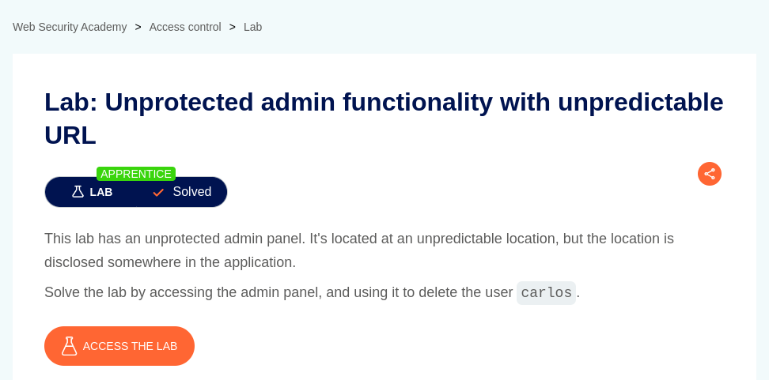

# Unprotected admin functionality with unpredictable URL

**Lab Url**: [https://portswigger.net/web-security/access-control/lab-unprotected-admin-functionality-with-unpredictable-url](https://portswigger.net/web-security/access-control/lab-unprotected-admin-functionality-with-unpredictable-url)



## Observation

This application discloses the location of the admin panel inside a `script` tag on the home page.

The `script` tag looks something like this.


In the below code, you can find the location of the admin panel. Which is explicitly set on the `href` attribute.

```html
<script>
    var isAdmin = false;
    if (isAdmin) {
    var topLinksTag = document.getElementsByClassName("top-links")[0];
    var adminPanelTag = document.createElement('a');
    adminPanelTag.setAttribute('href', '/admin-35z3lc');
    adminPanelTag.innerText = 'Admin panel';
    topLinksTag.append(adminPanelTag);
    var pTag = document.createElement('p');
    pTag.innerText = '|';
    topLinksTag.appendChild(pTag);
    }
</script>
```

## Solution


To solve the lab, visit the admin panel. Now delete the user `carlos`.


