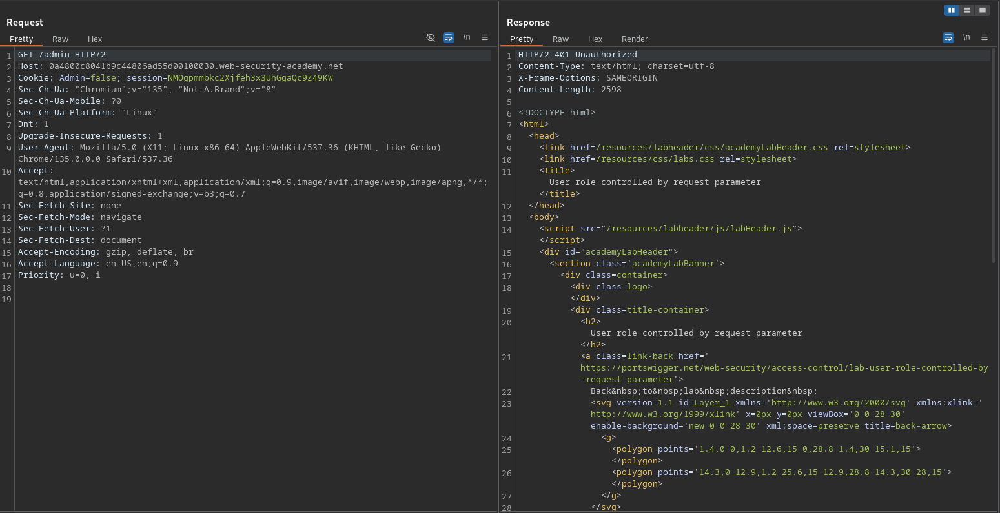

# User role controlled by request parameter

**Lab Url**: [https://portswigger.net/web-security/access-control/lab-user-role-controlled-by-request-parameter](https://portswigger.net/web-security/access-control/lab-user-role-controlled-by-request-parameter)

## Analysis

The application showcases an image catalog with an image, a title, a price, a star rating, and a "View Details" button. Additionally, it has a `/my-account` page that redirects to the `/login` page. Log in to the application with the provided credentials on the lab description. Now try to access the admin panel at `/admin`.

You can observe that the application returns a `401 unauthorized code`.

## Solution

To access the admin panel modify the cookie value `Admin` to `true`.

The admin panel would look something like this.

Now delete the user carlos to solve the lab.

