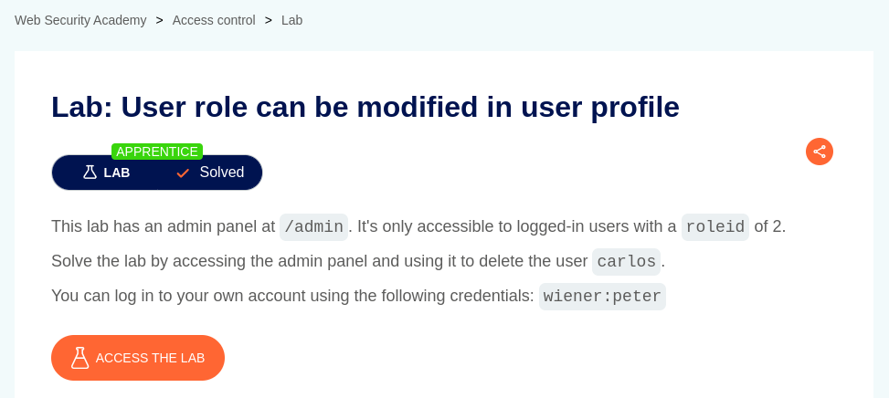
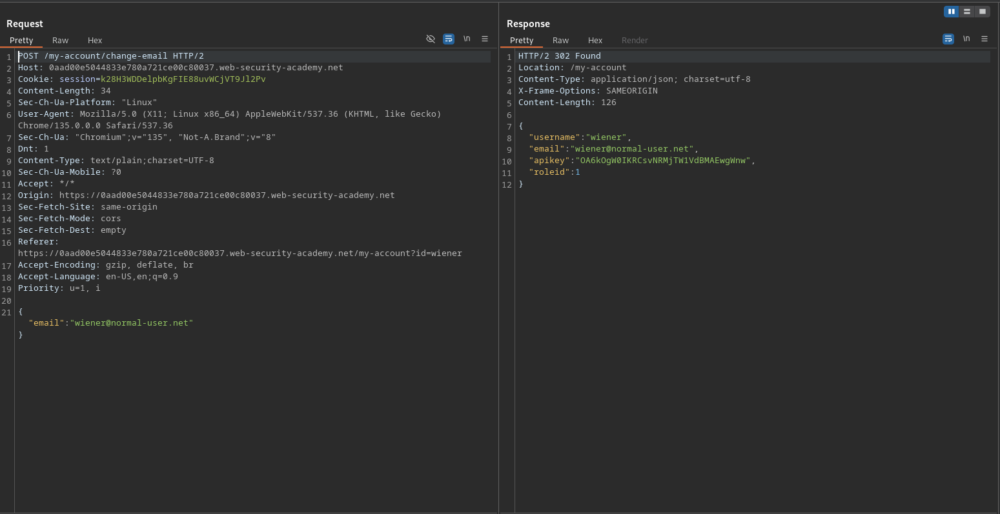
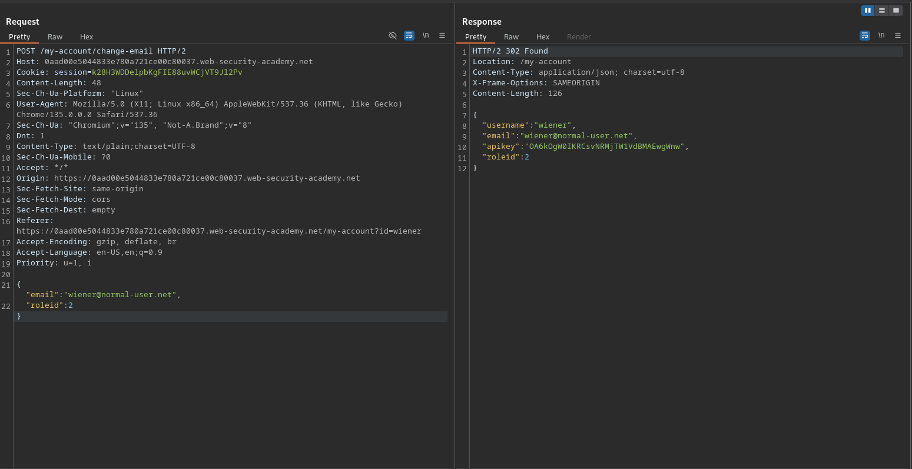
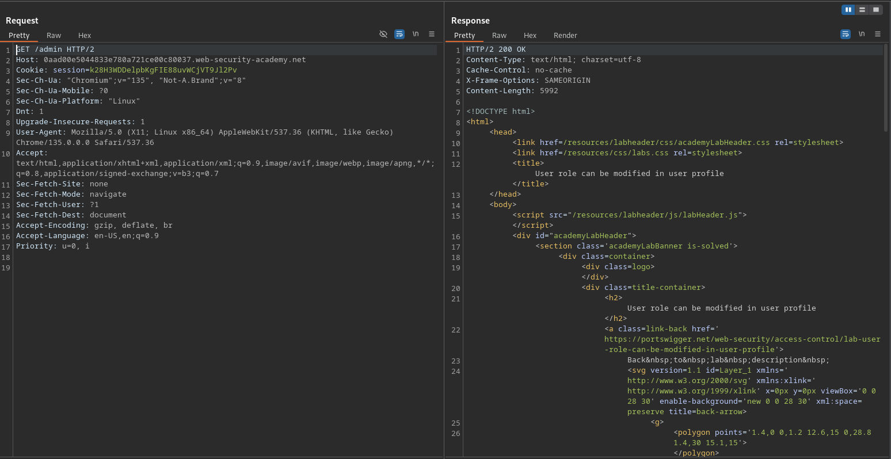
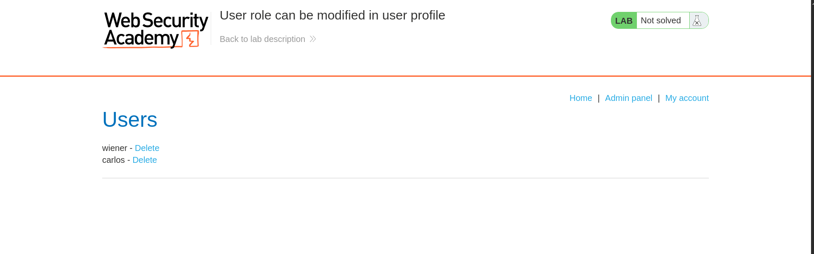
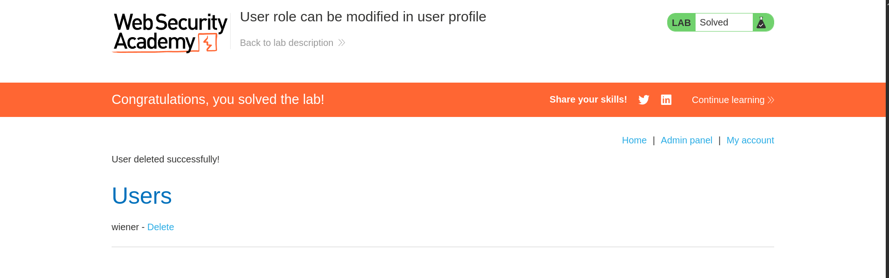

# User role can be modified in user profile

**Lab Url**: [https://portswigger.net/web-security/access-control/lab-user-role-can-be-modified-in-user-profile](https://portswigger.net/web-security/access-control/lab-user-role-can-be-modified-in-user-profile)

## Analysis

The application showcases an image catalog with an image, a title, a price, a star rating, and a "View Details" button. Additionally, it has a `/my-account` page that redirects to the `/login` page. Log in to the application with the provided credentials on the lab description. Now try to access the admin panel at `/admin`.

You can observe that the application returns a `401 unauthorized code`.

Let's take a good look at the `/my-account?id=wiener` page and what functionality it contains. Hmm, the page has a change email form. Let's observe what it does.

Observe that the object returns other keys along with `email` like `username`, `apiKey`, and `roleId`.

From the lab description, we know that the admin page is only accessible to users with `roleId 2`. So let's try to change the `roleId` of our user.

## Solution

Now we can access the admin page.

The admin page would look something like this. To solve the lab delete the user `carlos`.

