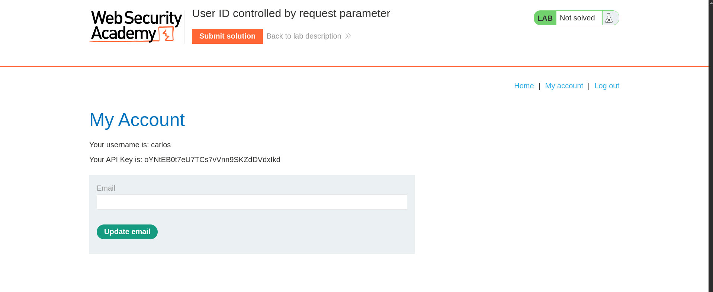

# User ID controlled by request parameter

**Lab Url**: [https://portswigger.net/web-security/access-control/lab-user-id-controlled-by-request-parameter](https://portswigger.net/web-security/access-control/lab-user-id-controlled-by-request-parameter)

## Analysis

The application showcases an image catalog with an image, a title, a price, a star rating, and a "View Details" button. Additionally, it has a `/my-account` page that redirects to the `/login` page.

Log in to the application using the credentials provided in the lab description. Notice that the account page has an API key.

The URL of wiener's account page looks something like this `/my-account?id=wiener`.

Let's change the `id` parameter from `wiener` to `carlos` to see how the application behaves. *`/my-account?id=carlos`*

Hmm, we are able to access the account page of `carlos`.

## Solution

**To solve the lab, submit the api key of `carlos`.**

