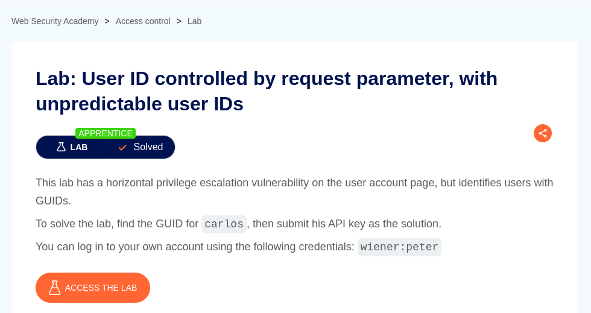
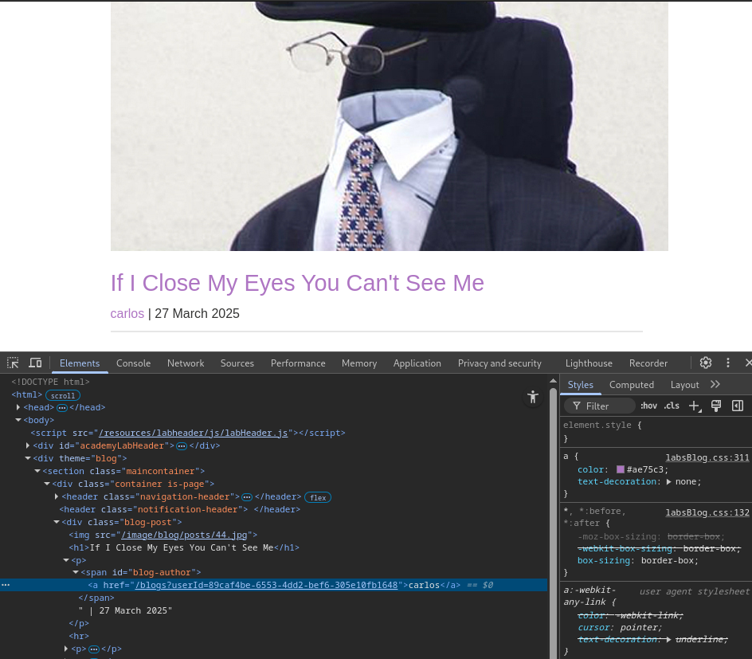
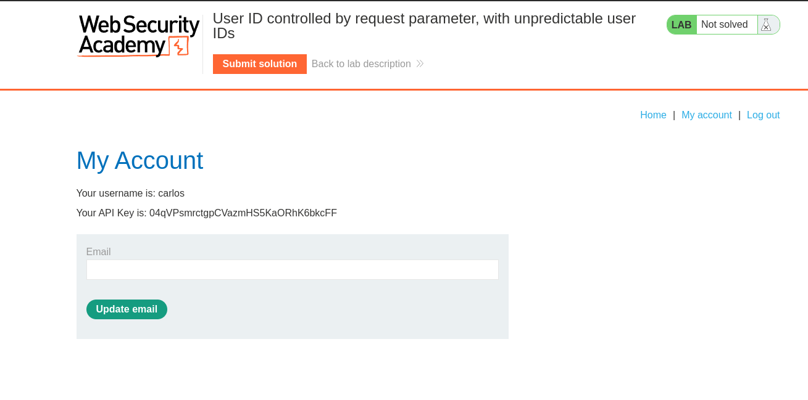
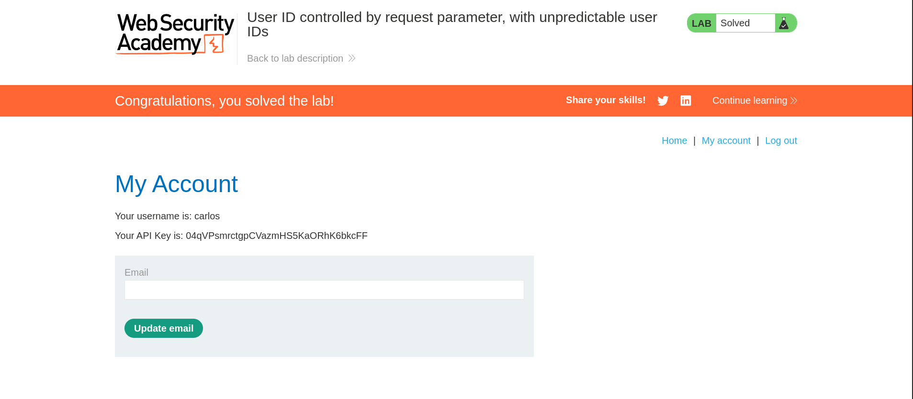

# User ID controlled by request parameter

**Lab Url**: [https://portswigger.net/web-security/access-control/lab-user-id-controlled-by-request-parameter](https://portswigger.net/web-security/access-control/lab-user-id-controlled-by-request-parameter)

## Analysis

Like the previous lab, this application also showcases an image catalog with an image, a title, a price, a star rating, and a "View Details" button. It also has a `/my-account` page that redirects to the `/login` page.

Log in to the application using the credentials provided in the lab description. Notice that your ID is a random [GUID](https://en.wikipedia.org/wiki/Universally_unique_identifier). It can't be guessed like in the previous lab. *`(e.g) /my-account?id=43eaba49-94ca-461b-bb8f-7c918e41cca0`*

However, the application discloses the user IDs inside the author section of blog posts. You can find the ID of the user Carlos in one of the blog posts.

After finding `carlos's` ID change the ID parameter, on the URL of the My Account page. *Now you can access the My Account page Carlos along with its API key.*

## Solution

**Submit Carlo's API key to solve the lab.**

