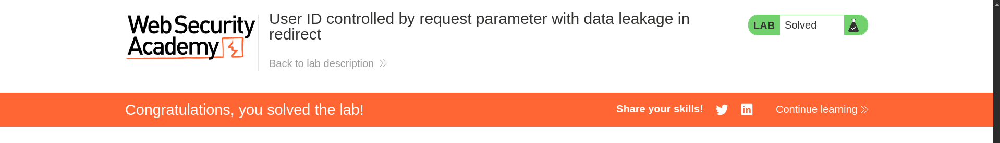

# User ID controlled by request parameter with data leakage in redirect

**Lab Url**: [https://portswigger.net/web-security/access-control/lab-user-id-controlled-by-request-parameter-with-data-leakage-in-redirect](https://portswigger.net/web-security/access-control/lab-user-id-controlled-by-request-parameter-with-data-leakage-in-redirect)

## Analysis

Like the previous lab, this application also showcases an image catalog with an image, a title, a price, a star rating, and a "View Details" button. It also has a `/my-account` page that redirects to the `/login` page.

Log in to the application using the credentials provided in the lab description.

In the *My Account* page, you can see that the `id` parameter is set to `wiener`. If you change the `id` parameter to `carlos` the application will redirect you to the login page.

**However, the application reveals sensitive data while redirecting.**

## Solution

**To solve the lab, submit the `carlos` API key.**

