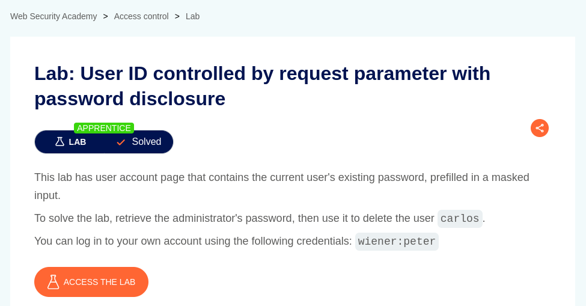
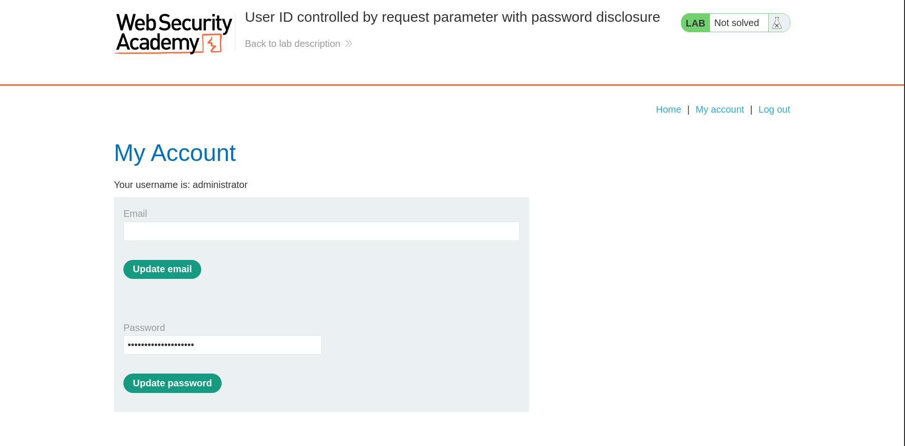
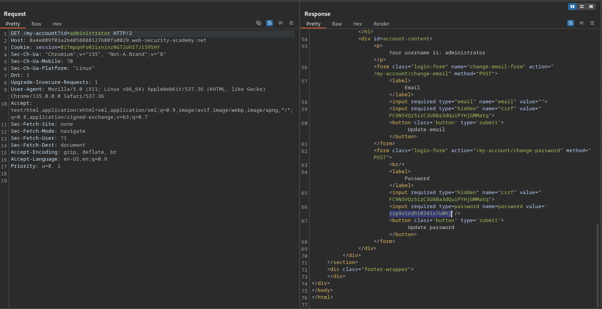
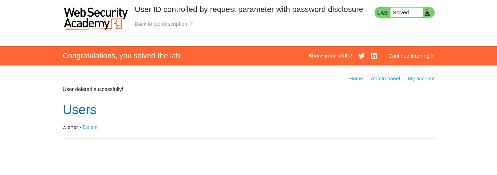

# User ID controlled by request parameter with password disclosure

**Lab Url**: [https://portswigger.net/web-security/access-control/lab-user-id-controlled-by-request-parameter-with-password-disclosure](https://portswigger.net/web-security/access-control/lab-user-id-controlled-by-request-parameter-with-password-disclosure)

## Analysis

After logging in to the **My Account** page of the user `wiener`, we can observe that the application contains the user's existing password, prefilled in a masked input.

We can change the `id` parameter on the `/my-account` page to retrieve the password of the `administrator`.

Now log out of the application and log in again as an administrator user with retrieved password.

## Solution

As an administrator user, you can access the admin panel.

**To solve the lab delete the user Carlos from the admin panel.**

