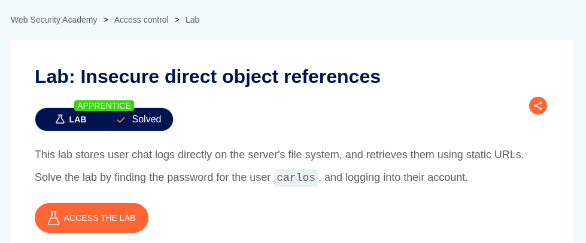
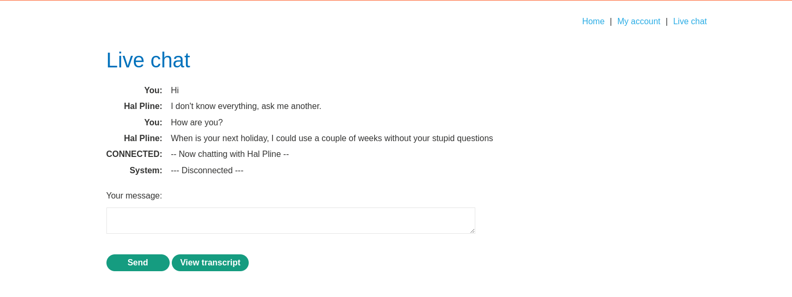
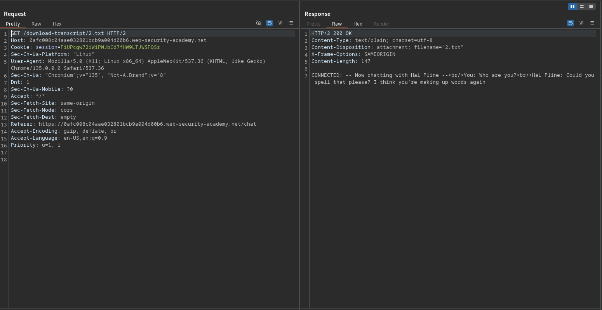
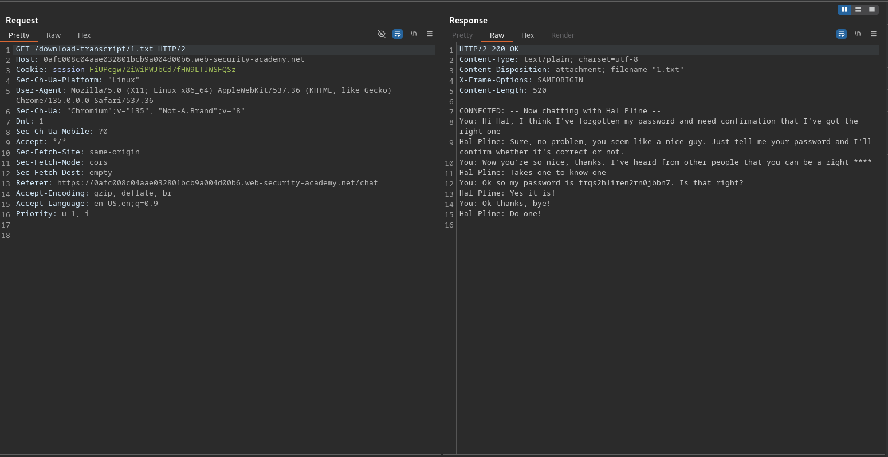
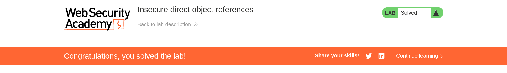

# User ID controlled by request parameter with password disclosure

**Lab Url**: [https://portswigger.net/web-security/access-control/lab-user-id-controlled-by-request-parameter-with-password-disclosure](https://portswigger.net/web-security/access-control/lab-user-id-controlled-by-request-parameter-with-password-disclosure)

## Analysis

The application contains a live chat functionality along with two other features to send text and "View transcript".

The "View transcript" button downloads the chart log from a static URL. The URL looks something like this `/download-transcript/2.txt`

Interestingly, even if I download the transcript for the first time, the text file is named `2.txt`.

**Hmm, the retrieved chart log reveals some interesting content. It contains a user's password.**

## Solution

The lab description indicates that there is a user Carlos. And the password we retrieved is most likely to be its.

**To solve the lab login as `carlos` with the retrieved password.**

