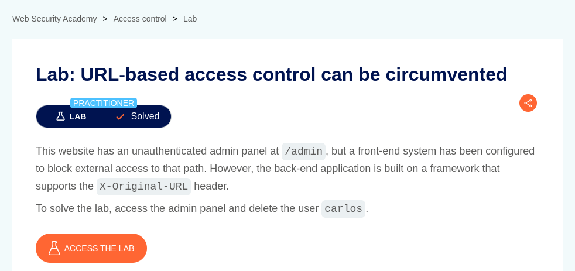
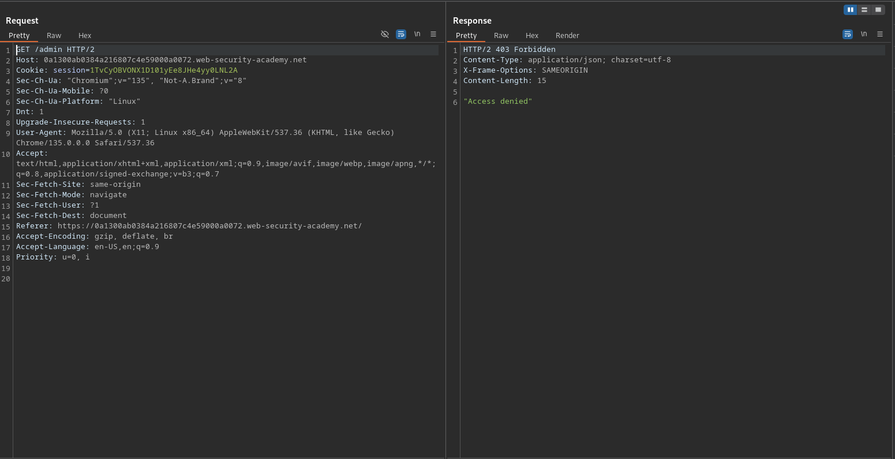
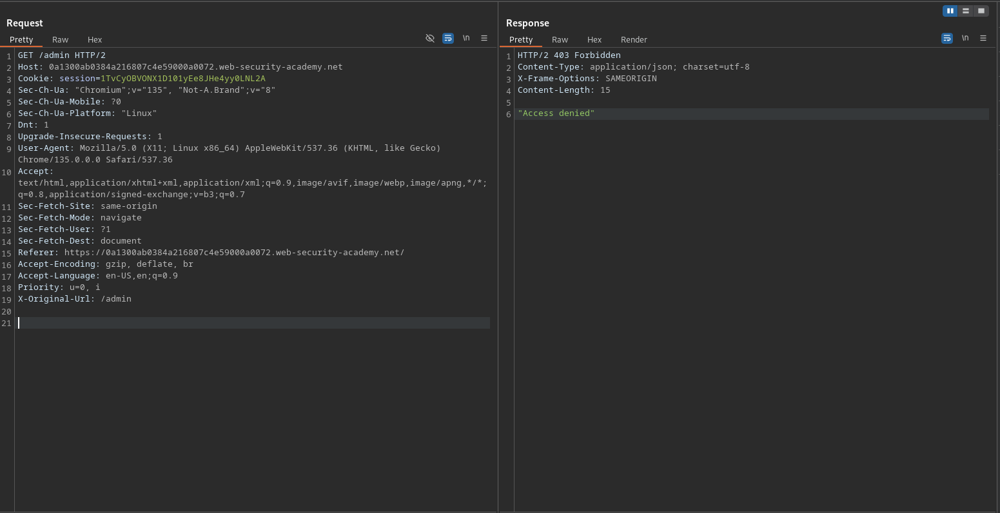
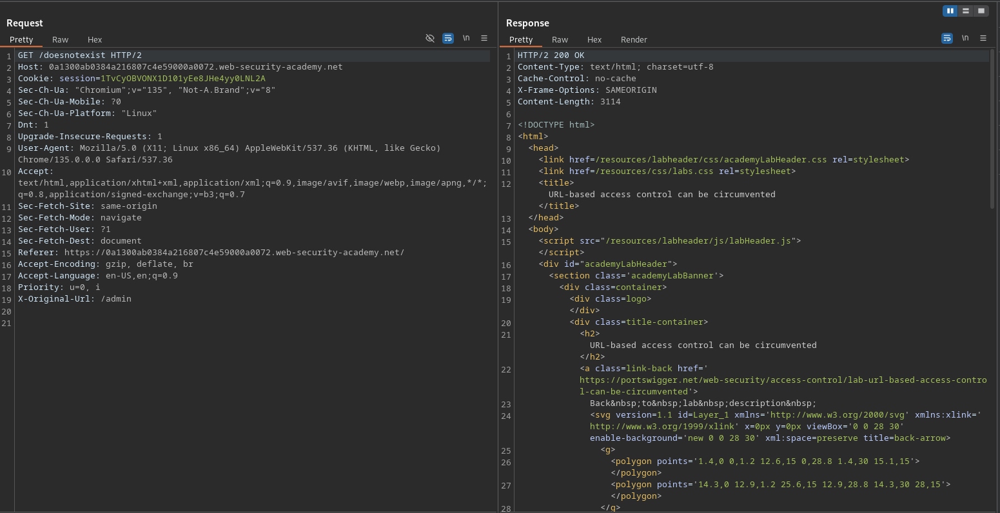
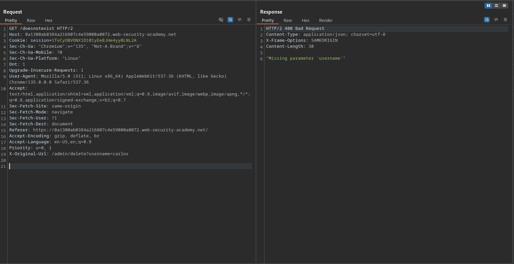
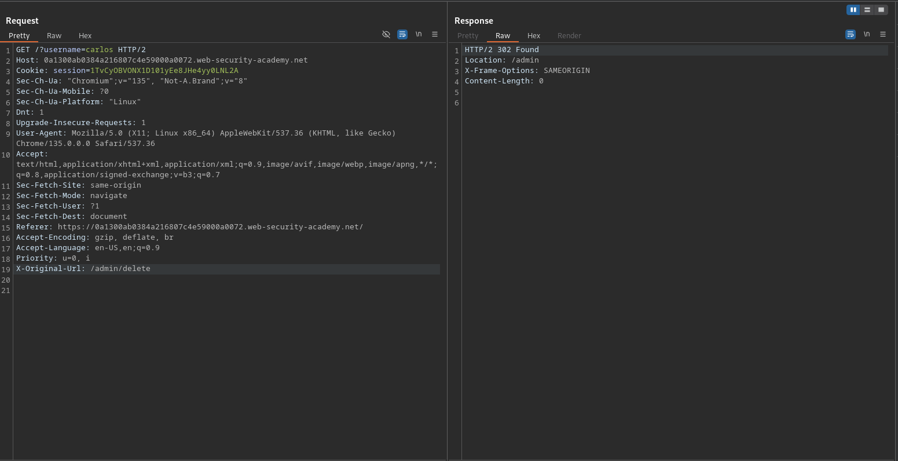
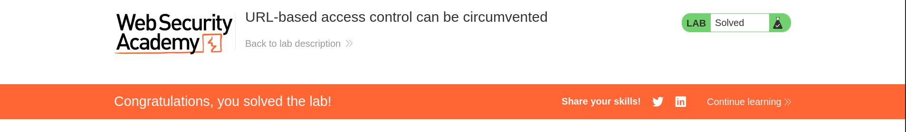

# URL-based access control can be circumvented

**Lab Url**: [https://portswigger.net/web-security/access-control/lab-url-based-access-control-can-be-circumvented](https://portswigger.net/web-security/access-control/lab-url-based-access-control-can-be-circumvented)

## Analysis

The initial step is to understand how the vulnerable application works and gather information about the target system. The application showcases an image catalog with an image, a title, a price, a star rating, and a "View Details" button that redirects to the product page.

If you try to visit the admin page, you will receive **`403 Forbidden`** status.

The lab description states that the application supports the `X-Original-URL` header.

Even if you add the `X-Original-URL` header on the request tab and try to access the admin page, you will receive `403 Forbidden` Status.

To access the admin page, issue a `GET` request to a non-existent URL while setting the value of the `X-Original-URL` header to `/admin`.

## Solution

From the admin panel source code, you can retrieve the URL to delete the user `carlos`.

Hmm, we got an error indicating that there is a Missing parameter `username`.

To delete the user `carlos` change the `GET` request to `/?username=carlos` and X-Original-URL to `/admin/delete`.

