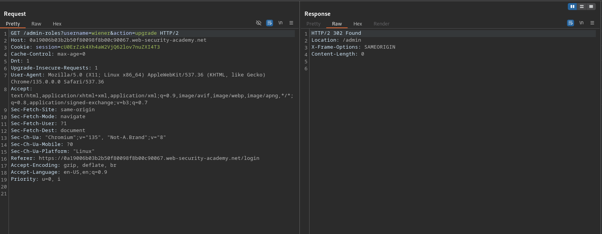

# Method-based access control can be circumvented

**Lab Url**: [https://portswigger.net/web-security/access-control/lab-method-based-access-control-can-be-circumvented](https://portswigger.net/web-security/access-control/lab-method-based-access-control-can-be-circumvented)

## Analysis

After logging in to the **My Account** page of the `administrator` user using the credentials provided on the lab's description. Observe that the navbar has an admin panel. The Admin Panel provides a way to upgrade or downgrade a user's role.

Issue an upgrade role request for user `carlos`. It looks something like this. The `POST` request has two parameters `username` and `action`. And `action` is set to `upgrade`.

Now log out of the application and log in again as `wiener`. Now let's try to access the admin panel. Hmm, we got a `401 unauthorized` status as expected.

We are unable to access the `/admin` page. Let's try to access the `/admin-roles`. Hmm, instead of `401 unauthorized` status we got `302` Found status.

## Solution

Since we are able to access and probably modify the roles of users with `GET` requests. Let's issue a `GET` request with the parameter `username` and `action` to elevate the user to `ADMIN`.

