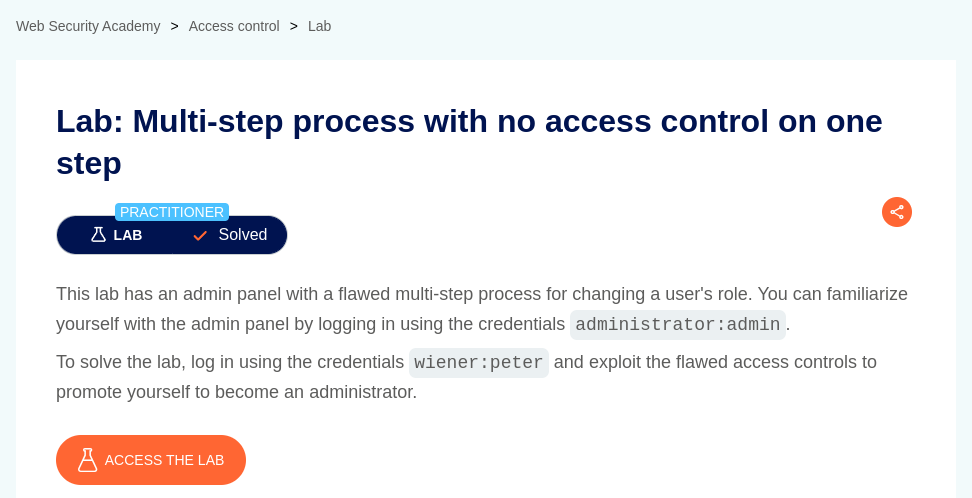
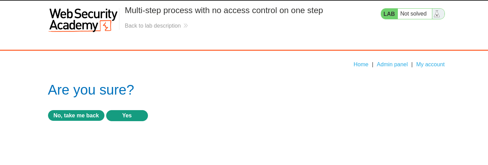
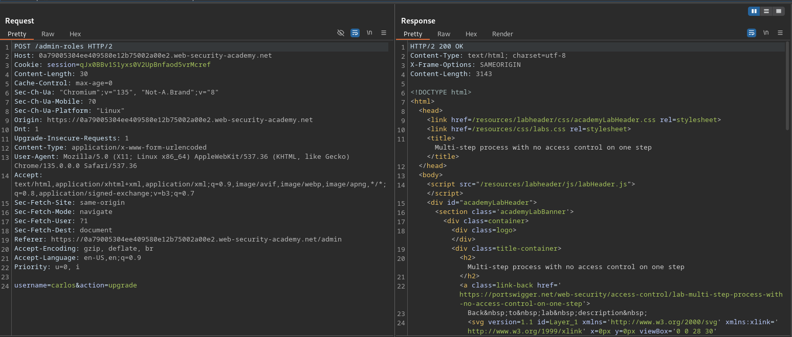
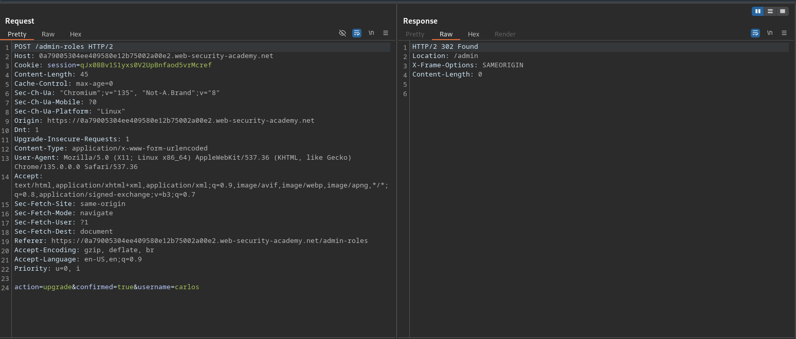
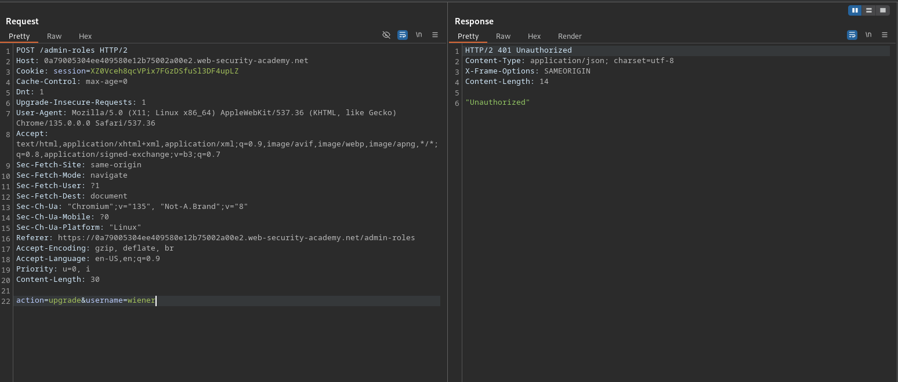
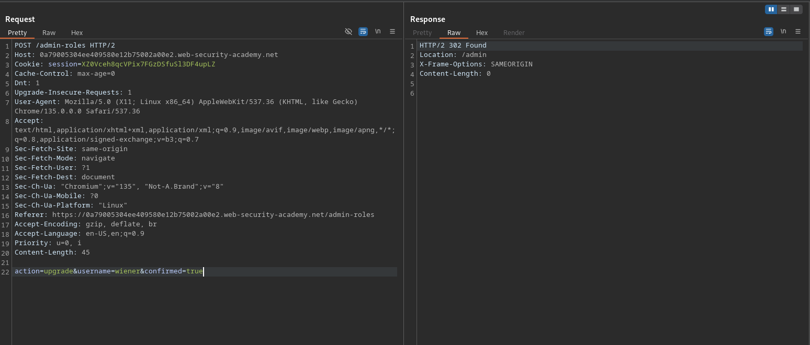
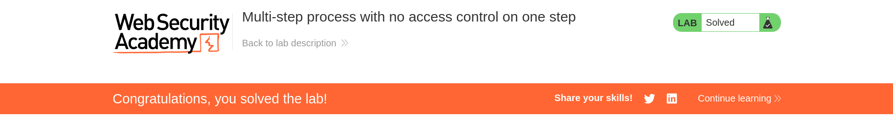

# Multi-step process with no access control on one step

**Lab Url**: [https://portswigger.net/web-security/access-control/lab-multi-step-process-with-no-access-control-on-one-step](https://portswigger.net/web-security/access-control/lab-multi-step-process-with-no-access-control-on-one-step)

## Analysis

After logging in to the **My Account** page of the `administrator` user using the credentials provided on the lab's description. Observe that the navbar has an admin panel. The Admin Panel provides a way to upgrade or downgrade a user's role.

However, before upgrading or downgrading a user, it pops up a confirmation page.

The user role upgrade request looks like this.

The confirmation page appends additional parameter `confirm` on `POST` request.

Now log out of the application and log in again as a user `wiener`. Let's try to modify the user roles again with URL `/admin-roles` as a normal user. Hmm, we got a `401 unauthorized` Status.

## Solution

Append the parameter `confirm=true` and issue the `POST` request again. Hmm, we successfully elevated the role of the user `wiener`.

