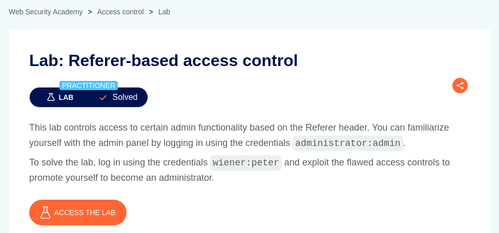
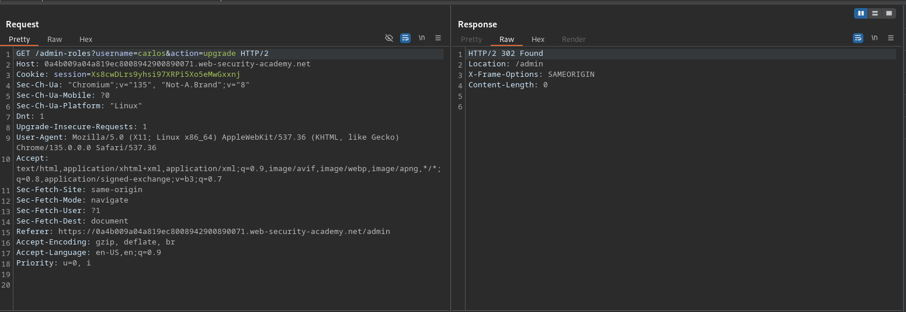
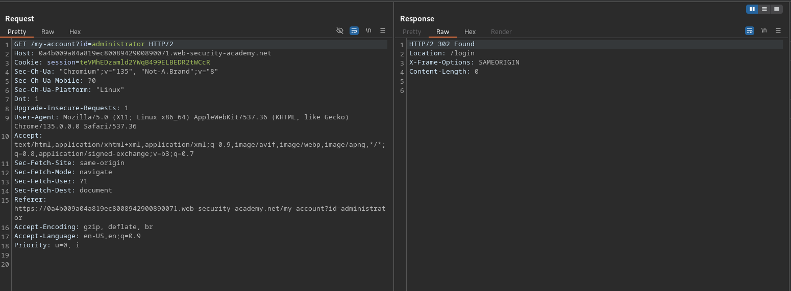
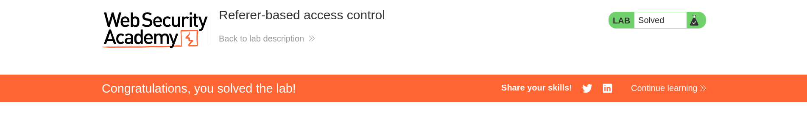

# Referer-based access control

**Lab Url**: [https://portswigger.net/web-security/access-control/lab-referer-based-access-control](https://portswigger.net/web-security/access-control/lab-referer-based-access-control)

## Analysis

After logging in to the **My Account** page of the `administrator` user using the credentials provided on the lab's description. Observe that the navbar has an admin panel. The Admin Panel provides a way to upgrade or downgrade a user's role.

The upgrade user role action issues a `GET` request with parameters `username` and `action`.  The request header also contains a `Referer` header with assigned value `https://YOUR-LAB-ID.web-security-academy.net/admin`.

Log out of the application and log in again as a `wiener`. Now try to access the **My Account page** (`/my-account?id=administrator`) of administrator with the `Referer` header being set to `https://YOUR-LAB-ID.web-security-academy.net/my-account?id=administrator`.

Hmm, instead of `401 Unauthorized` or `403 Forbidden` Status Code we got `302 Found`.

## Solution

Since we know that we can upgrade a user role from URL `/admin-roles` let's upgrade the role of `wiener` to solve the lab.

**Note that the application uses a `Referer` header for access control you need to set the `Referer` header to `https://YOUR-LAB-ID.web-security-academy.net/admin` to modify the user role.**

