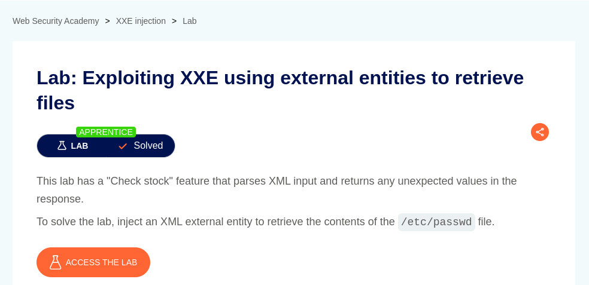
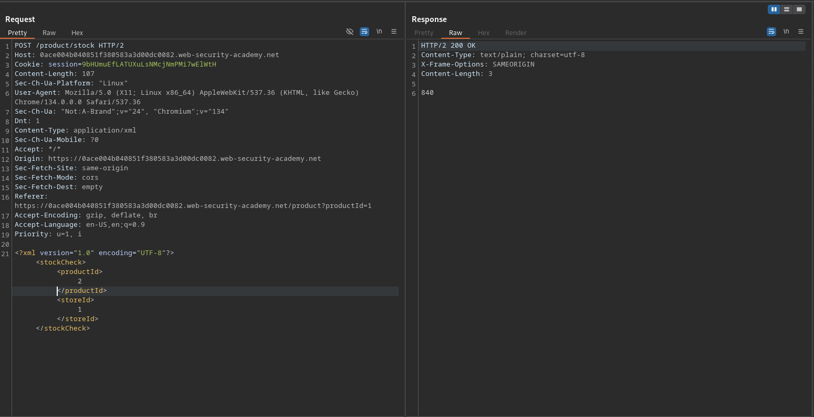
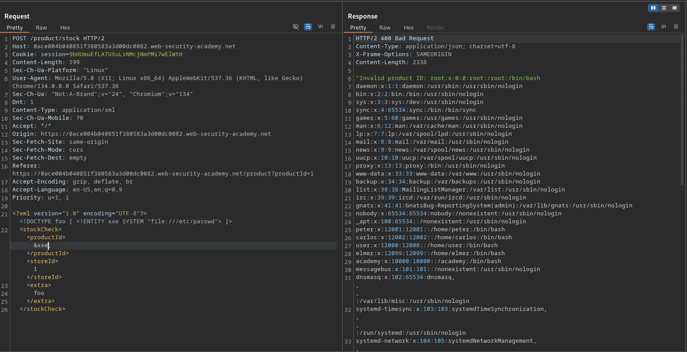
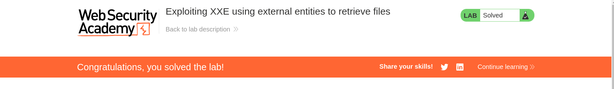

# Exploiting XXE using external entities to retrieve files

**Lab Url**: [https://portswigger.net/web-security/xxe/lab-exploiting-xxe-to-retrieve-files](https://portswigger.net/web-security/xxe/lab-exploiting-xxe-to-retrieve-files)

## Analysis

The initial step is to understand how the vulnerable application works and gather information about the target system. The application showcases an image catalog with an image, a title, a price, a star rating, and a "View Details" button that redirects to the product page. The product page has a check stock functionality that transfers data in XML format.

## Solution

Let's introduce a DOCTYPE element that defines an external entity containing the path to the file and check if the application is vulnerable to XXE injection attack.

Hmm, the defined external entity worked and we are able to retrieve the content of `/etc/passwd` file.

