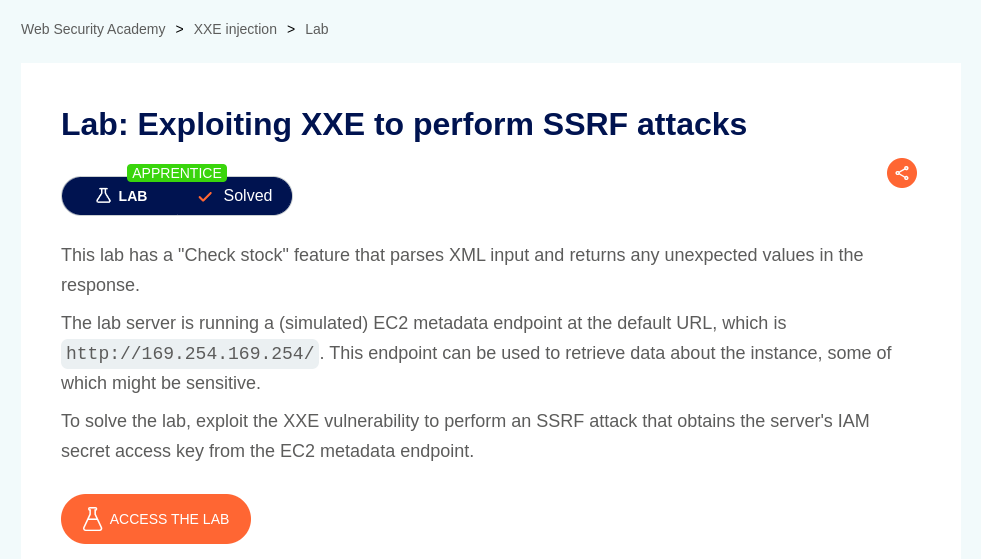
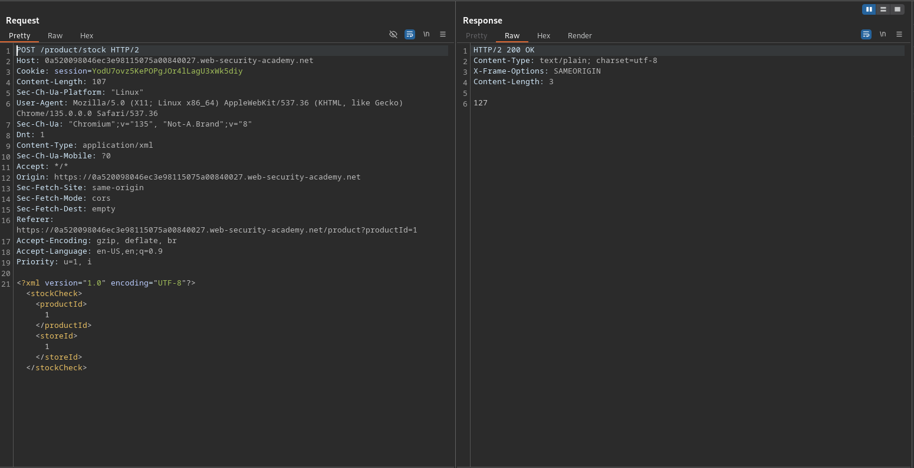
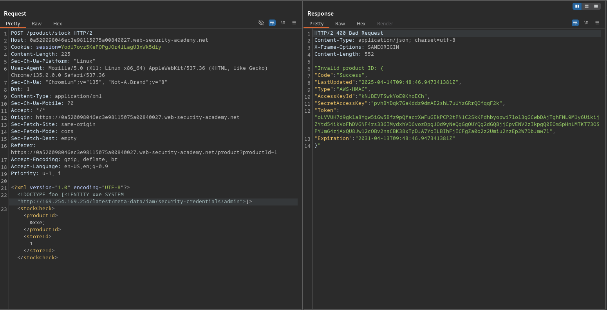
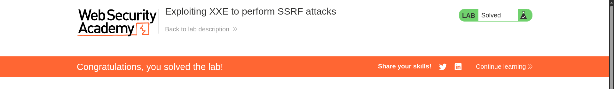

# Exploiting XXE to perform SSRF attacks

**Lab Url**: [https://portswigger.net/web-security/xxe/lab-exploiting-xxe-to-perform-ssrf](https://portswigger.net/web-security/xxe/lab-exploiting-xxe-to-perform-ssrf)



## Analysis

The initial step is to understand how the vulnerable application works and gather information about the target system. The application showcases an image catalog with an image, a title, a price, a star rating, and a "View Details" button that redirects to the product page. The product page has a check stock functionality that transfers data in XML format.



## Conclusion

**Instance metadata in an EC2 instance is data about the instance itself that is made available within the running instance.  It's accessible directly from within the instance at a non-routable IP address (`169.254.169.254`).**

Let's introduce a DOCTYPE element that defines an external entity containing the path to the `meta-data` url to check if the application is vulnerable to XXE injection attack.

```xml
<!DOCTYPE foo [<!ENTITY xxe SYSTEM "http://169.254.169.254/latest/meta-data/iam/security-credentials/admin">]>
```




