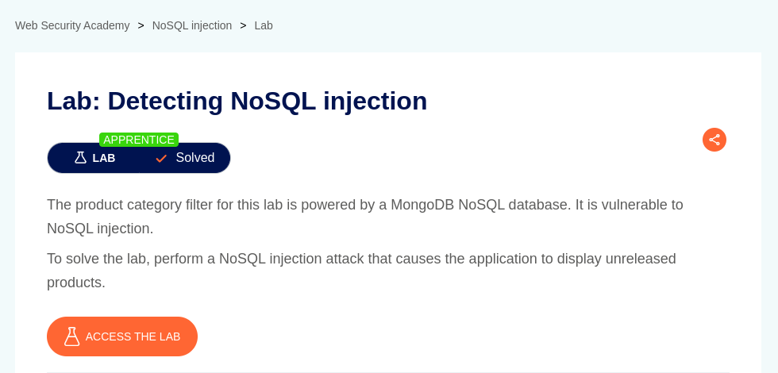
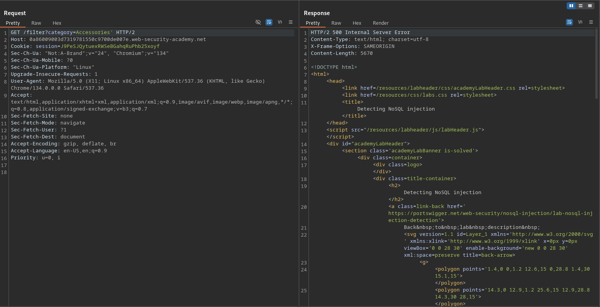
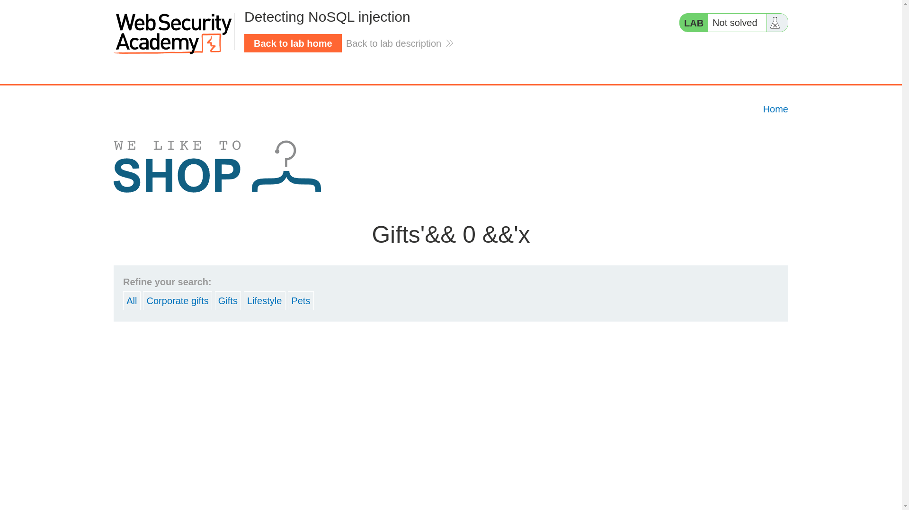
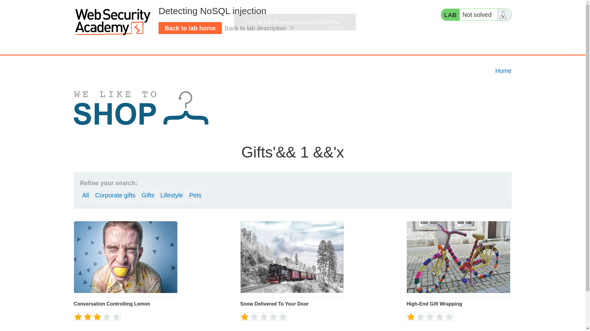
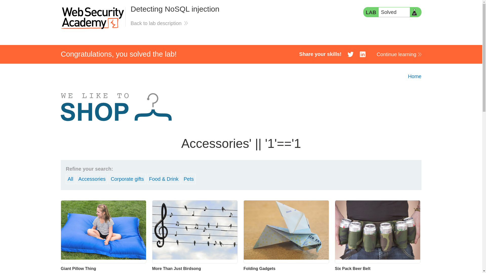

# Detecting NoSQL injection

**Lab Url**: [https://portswigger.net/web-security/nosql-injection/lab-nosql-injection-detection](https://portswigger.net/web-security/nosql-injection/lab-nosql-injection-detection)



## Analysis

The product category filter for this lab is powered by a MongoDB NoSQL database and is vulnerable to NoSQL injection. Upon examining the vulnerable application, it is concluded that it showcases an image catalog with an image, a title, a price, a star rating, and a "View details" button. The home page also has a **navbar to filter the catalog** according to your needs.

The application behaves differently (`throw 500 Internal server error`) if an apostrophe **`'`** is added after the value of the category filter.

```bash
ilter?category=Accessories'
```



This may happen because of broken query syntax and caused a syntax error. Next, we need to identify whether we can exploit Boolean conditions using NoSQL syntax. After submitting two distinct queries, we concluded that boolean logic alters the application response.

```bash
/filter?category=Gifts%27%26%26+0+%26%26%27x
```



```bash
/filter?category=Gifts%27%26%26+1+%26%26%27x
```



Now that we know, we can influence boolean conditions, we can attempt to override existing conditions to exploit the vulnerability. **We can inject conditions that are always evaluated to be `TRUE`**.

```bash
/filter?category=Accessories%27%7c%7c%27%31%27%3d%3d%27%31
```


